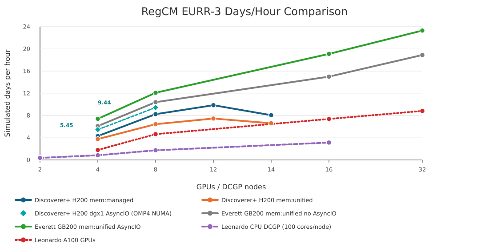
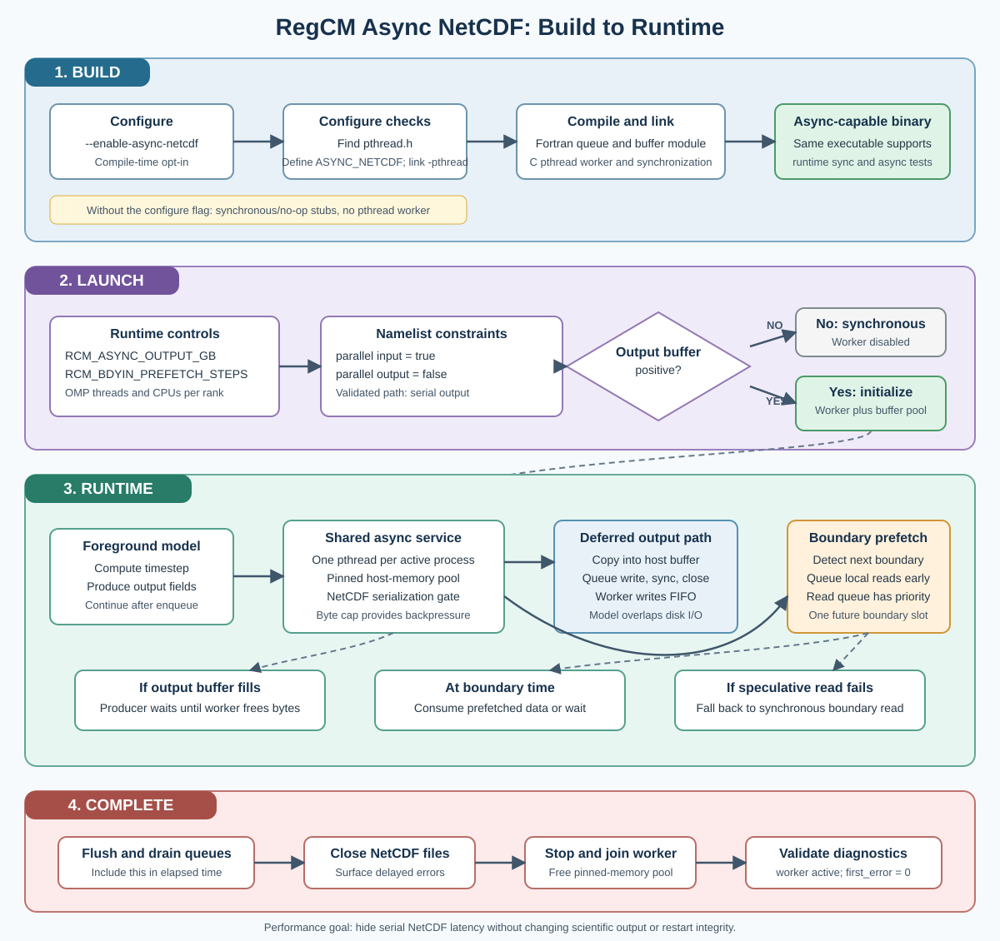

# RegCM on Discoverer+: Software Stack and Benchmark Report

## 1. Software Stack

This report documents the software environment built and validated for running the GPU-enabled RegCM model on the Discoverer+ system. The stack uses the NVIDIA HPC SDK supplied by Discoverer+ together with a private, compiler- and MPI-compatible scientific I/O stack.

Unless otherwise noted, benchmark timings in this report refer to the production `mem:managed` executable at `bin/regcmMPICLM45`. Ongoing `mem:unified` tests use a separate executable and run tree and are reported separately from the production scaling tables.

### 1.0 RegCM on Discoverer+: Validated Software Stack

The runtime stack is intentionally kept to one compiler/MPI family plus a private scientific I/O stack built with that same family.

Dependency order:

1. Discoverer+ compute node: H200 GPUs, `cc90`, real NVIDIA driver library at `/usr/lib64/libcuda.so.1`.
2. NVIDIA HPC SDK module: `nvidia/hpcsdk/nvhpc-hpcx-cuda12/25.1`, providing NVHPC 25.1, CUDA 12.6, HPC-X 2.21, and Open MPI 4.1.7rc1.
3. Compiler and MPI wrappers from that module: `nvc`, `nvc++`, `nvfortran`, `mpicc`, `mpicxx`, and `mpifort`.
4. Private I/O stack built with those wrappers: libaec, HDF5, PnetCDF, NetCDF-C, NetCDF-Fortran, plus system zlib.
5. RegCM environment loader: `environment_loader/regcm5_discoverer_nvhpc25_1_hpcx_cuda12.sh`, which loads the module and points build/runtime paths to the private I/O stack.
6. RegCM executable: production `mem:managed` binary at `bin/regcmMPICLM45`; separate experimental `mem:unified` binary at `bin/mem_unified/regcmMPICLM45`.
7. Slurm launch layer: `sbatch` allocation plus `srun --mpi=pmix` running one MPI rank per GPU.
8. Per-rank wrapper: sets `CUDA_VISIBLE_DEVICES=$SLURM_LOCALID`, `ACC_DEVICE_TYPE=nvidia`, `ACC_DEVICE_NUM=0`, and OpenMP placement variables.
9. Running application: RegCM with CLM4.5 on the EURR-3 domain, using MPI decomposition, GPU offload/stdpar execution, and NetCDF I/O.

Public Discoverer+ HDF5 and NetCDF modules were avoided because they pull a different compiler/MPI stack. The private libraries were built with the same NVHPC and HPC-X wrappers used for RegCM.

### 1.1 Platform

<a id="table-1"></a>

**Table 1. Discoverer+ benchmark platform configuration.**

| Item | Configuration |
|---|---|
| System | Discoverer+ |
| Slurm partition | `common` |
| Project account | `ehpc-ben-2026b06-085` |
| Project QoS | `ehpc-ben-2026b06-085` |
| GPU | NVIDIA H200 |
| GPU compute capability | 9.0 |
| RegCM GPU target | `cc90` |
| Project maximum walltime | `02:00:00` per job |

The H200 architecture was verified on a compute node. RegCM's NVHPC GPU architecture setting was therefore changed from `ccnative` to `cc90` in `configure.ac` and the generated `configure` script.

### 1.2 Compiler, CUDA, and MPI

The base programming environment is loaded with:

```bash
module purge
module load nvidia/hpcsdk/nvhpc-hpcx-cuda12/25.1
```

The module provides the following toolchain:

<a id="table-2"></a>

**Table 2. Compiler, CUDA, and MPI toolchain versions.**

| Component | Version or selection |
|---|---|
| NVIDIA HPC SDK | 25.1 |
| C compiler | `nvc` |
| C++ compiler | `nvc++` |
| Fortran compiler | `nvfortran` |
| CUDA toolkit | 12.6 |
| HPC-X | 2.21 |
| MPI implementation | HPC-X Open MPI 4.1.7rc1 |
| MPI C wrapper | `mpicc` |
| MPI Fortran wrapper | `mpifort` |

The CUDA installation used at build and runtime is:

```text
/weka/software/nvidia/packages/hpc_sdk/Linux_x86_64/25.1/cuda/12.6
```

The loader explicitly sets both `CUDA_HOME` and `NVHPC_CUDA_HOME` to this location.

### 1.3 Private Scientific I/O Stack

The public Discoverer+ HDF5 and NetCDF modules were not used because the available modules pull compiler and MPI dependencies based on LLVM/GCC Open MPI. Mixing those modules with NVHPC and HPC-X would produce an inconsistent compiler/MPI stack.

Instead, the required libraries were built privately using the same NVHPC 25.1 and HPC-X wrappers as RegCM.

Installation prefix:

```text
/valhalla/projects/ehpc-ben-2026b06-085/tchristian/software/regcm5-discoverer-nvhpc25.1-hpcx
```

<a id="table-3"></a>

**Table 3. Private scientific I/O stack used by RegCM.**

| Library | Version | Important build properties |
|---|---:|---|
| libaec | 1.1.3 | Shared library, built with `nvc` |
| HDF5 | 1.14.6 | Shared, high-level, parallel, and Fortran interfaces enabled |
| Parallel-NetCDF | 1.14.0 | Shared library and Fortran interface enabled |
| NetCDF-C | 4.9.3 | NetCDF-4 and PnetCDF support enabled; DAP disabled |
| NetCDF-Fortran | 4.6.2 | Shared library built with `mpifort` |
| zlib | Discoverer system library | `/usr/lib64/libz.so` |

HDF5, PnetCDF, NetCDF-C, and NetCDF-Fortran were built with the HPC-X wrappers `mpicc`, `mpicxx`, and `mpifort`. The system zlib was retained because HPC-X/Open MPI requires the system library's versioned `ZLIB_*` symbols. Stale libtool `.la` files were removed to avoid invalid absolute MPI dependency paths.

The dependency build script is:

```text
environment_loader/build_regcm5_discoverer_deps.sh
```

The private stack build completed successfully in Slurm job `178394`.

### 1.4 Environment Loader

The validated loader is:

```text
/valhalla/projects/ehpc-ben-2026b06-085/tchristian/work/RegCM/environment_loader/regcm5_discoverer_nvhpc25_1_hpcx_cuda12.sh
```

Its main responsibilities are:

- Purge inherited modules and load NVHPC 25.1 with CUDA 12.6 and HPC-X.
- Select `nvc`, `nvc++`, and `nvfortran` as the serial compilers.
- Select `mpicc` and `mpifort` as the MPI wrappers.
- Locate the NVHPC, CUDA, compiler runtime, and mathematical library directories.
- Add the private HDF5/NetCDF/PnetCDF prefix to the executable, include, link, and runtime search paths.
- Make CUDA stub libraries available for configure and link checks through `LIBRARY_PATH` and `LDFLAGS`.
- Keep CUDA stubs out of `LD_LIBRARY_PATH`, allowing compute-node runs to resolve the real NVIDIA driver library at `/usr/lib64/libcuda.so.1`.
- Validate the required compilers, MPI wrappers, and I/O configuration tools.

The loader currently defaults to an Open MPI shim and disables UCC collectives:

```bash
export REGCM_DISCOVERER_USE_MPI_SHIM=1
export REGCM_DISCOVERER_DISABLE_UCC=1
export REGCM_CUDA_STUBS=always
```

The shim is installed at:

```text
/valhalla/projects/ehpc-ben-2026b06-085/tchristian/software/discoverer-hpcx-2.21-ompi-shim
```

With UCC disabled, the loader exports:

```bash
export OMPI_MCA_coll=^ucc
```

Later ablation experiments showed that the shim, UCC setting, and CUDA stub policy did not materially change performance for the tested single-node, eight-GPU case. They are therefore retained as validated defaults rather than demonstrated performance requirements.

### 1.5 RegCM Build

The RegCM executable used for the successful runs reports revision `27e37e-dirty`, indicating local source/build changes relative to the recorded Git revision. The exact working-tree diff should be archived or committed for a fully reproducible release record.

RegCM was configured with:

```bash
./configure --enable-clm45 --enable-openacc-stdpar
```

The benchmark executable was built with NVHPC standard parallelism targeting the H200 architecture and the managed-memory model:

```text
-stdpar=gpu -gpu=cc90,lineinfo,mem:managed
```

All production timings in this report therefore correspond to the `mem:managed` binary. Results should not be mixed with future `mem:unified` experiments unless those binaries and run directories are reported separately.

The successful production executable was built without RegCM's `--enable-pnetcdf` option. PnetCDF remains installed and is enabled in NetCDF-C, so `libpnetcdf` can still appear in the executable's transitive runtime dependencies. The production namelist used parallel NetCDF input (`do_parallel_netcdf_in = .true.`) and serial NetCDF output (`do_parallel_netcdf_out = .false.`).

The resulting executable is:

```text
/valhalla/projects/ehpc-ben-2026b06-085/tchristian/work/RegCM/bin/regcmMPICLM45
```

The successful no-PnetCDF RegCM build and installation completed in Slurm job `178620`.

### 1.6 Runtime Configuration

The validated single-node launch uses one MPI rank per GPU:

```text
8 MPI ranks x 1 H200 GPU per rank
```

Each rank is assigned a GPU using `SLURM_LOCALID`:

```bash
export CUDA_VISIBLE_DEVICES=$SLURM_LOCALID
export ACC_DEVICE_TYPE=nvidia
export ACC_DEVICE_NUM=0
```

The application is launched through Slurm PMIx support:

```bash
srun --mpi=pmix ./STD_launch_per_rank.sh
```

The standard eight-GPU production script requests:

```text
nodes             = 1
tasks per node    = 8
CPUs per task     = 2
GPUs              = 8
exclusive node    = yes
```

OpenMP settings are:

```bash
export OMP_NUM_THREADS=$SLURM_CPUS_PER_TASK
export OMP_PROC_BIND=true
export OMP_PLACES=cores
```

### 1.7 Stack Validation

The stack was validated with the EURR-3 domain (`1003 x 1003 x 50`) for a one-day simulation with hourly I/O on eight H200 GPUs. Reference job `178785` completed successfully on `dgx1`:

<a id="table-4"></a>

**Table 4. Stack validation summary for one-day 8-GPU execution.**

| Metric | Result |
|---|---:|
| RegCM total elapsed time | 534.01 seconds |
| RegCM average elapsed time per simulated day | 534.01 seconds/day |
| MPI ranks | 8 |
| Final model time | `2009-09-02 00:00:00 UTC` |
| Result | Successful completion |

Runtime dependency inspection confirmed that the executable loaded:

- NetCDF-Fortran, NetCDF-C, HDF5, libaec, and PnetCDF from the private prefix.
- MPI libraries from HPC-X/Open MPI.
- NVHPC and CUDA 12.6 runtime libraries from the NVIDIA HPC SDK installation.
- The real compute-node NVIDIA driver library from `/usr/lib64/libcuda.so.1`.

## 2. Benchmark Configuration

### 2.1 System Topology

Discoverer+ exposes two DGX H200 GPU nodes in the `common` Slurm partition:

<a id="table-5"></a>

**Table 5. Discoverer+ node resources visible to the benchmark account.**

| Item | Configuration |
|---|---:|
| Slurm cluster | `disco-plus` |
| Partition | `common` |
| Nodes | `dgx1`, `dgx2` |
| GPUs per node | 8 x NVIDIA H200 SXM |
| HBM per GPU | 141 GB HBM3e |
| Host CPUs per node | 2 x Intel Xeon Platinum 8480C |
| CPU cores per node | 112 |
| Host memory per node | 2 TB DDR5 |

The documented intra-node GPU fabric is NVLink 4.0 plus NVSwitch:

<a id="table-6"></a>

**Table 6. Documented intra-node GPU interconnect topology.**

| Item | Configuration |
|---|---:|
| NVLink connections | 18 per GPU |
| Per-GPU bidirectional GPU interconnect bandwidth | 900 GB/s |
| NVSwitches | 4 per DGX H200 node |
| Aggregate bidirectional GPU-to-GPU bandwidth | 7.2 TB/s |

The documented inter-node network is 10 x ConnectX-7 adapters per node, each capable of 400 Gb/s InfiniBand/Ethernet. Therefore, runs up to 8 GPUs remain within a single NVSwitch-connected DGX node, while 12- and 14-GPU runs span `dgx1` and `dgx2` and communicate over the inter-node fabric.

### 2.2 Domain and Namelist

All production benchmarks used the EURR-3 domain:

<a id="table-7"></a>

**Table 7. EURR-3 model domain and timestep configuration.**

| Parameter | Value |
|---|---:|
| `iy` | 1003 |
| `jx` | 1003 |
| `kz` | 50 |
| Horizontal grid spacing | approximately 3.336 km |
| Timestep | 45 s |
| Calendar | Gregorian |
| Initial date | `2009-09-01 00:00:00 UTC` |

The 3-day production namelist used:

```text
mdate1 = 2009090100
mdate2 = 2009090400
```

The 7-day production namelist used:

```text
mdate1 = 2009090100
mdate2 = 2009090800
```

The output configuration enabled hourly CORDEX-style I/O:

<a id="table-8"></a>

**Table 8. Production output and NetCDF I/O configuration.**

| Output option | Value |
|---|---:|
| `ifcordex` | `.true.` |
| `ifatm` | `.true.` |
| `atmfrq` | 1.0 hour |
| `ifrad` | `.true.` |
| `radfrq` | 1.0 hour |
| `ifsrf` | `.true.` |
| `srffrq` | 1.0 hour |
| `ifsts` | `.true.` |
| `ifsave` | `.true.` |
| `do_parallel_netcdf_in` | `.true.` |
| `do_parallel_netcdf_out` | `.false.` |

Large NetCDF output files were deleted after validation to recover project storage. Slurm accounting records and production logs are the durable benchmark artifacts.

### 2.3 Run Matrix

The production `mem:managed` run trees are located under:

```text
Benchmark/production_runs/Discoverer_3day_with_IO
Benchmark/production_runs/Discoverer_7day_with_IO
```

The separate `mem:unified` experiment tree is:

```text
Benchmark/production_runs/Discoverer_mem_unified_tests
```

Each production `mem:managed` run directory uses the same loader, executable, per-rank GPU wrapper, and one-rank-per-GPU launch pattern. The `mem:unified` experiment tree reuses the same loader and launch pattern but uses its separate `mem:unified` executable. Each run writes to a unique scratch output directory under:

```text
/valhalla/projects/ehpc-ben-2026b06-085/tchristian/scratch/EURR3/output_from_runs
```

<a id="table-9"></a>

**Table 9. Production run matrix and feasibility status.**

| GPUs | MPI layout | Node layout | 3-day status | 7-day status |
|---:|---|---|---|---|
| 1 | 1 rank x 1 GPU | 1 node | Failed/intermittent diagnostic timeout | Not used for final 7-day matrix |
| 2 | 2 ranks x 1 GPU | 1 node | Completed | Timed out at 2-hour project limit |
| 4 | 4 ranks x 1 GPU | 1 node | Completed | Completed |
| 8 | 8 ranks x 1 GPU | 1 node | Completed | Completed |
| 12 | 12 ranks x 1 GPU | 2 nodes, 6 ranks per node | Completed | Completed |
| 14 | 14 ranks x 1 GPU | 2 nodes, 7 ranks per node | Completed after rerun | Completed |
| 16 | 16 ranks x 1 GPU | 2 nodes, 8 ranks per node | Slurm rejected request | Not used |
| 32 | 32 ranks x 1 GPU | More than visible allocation | Infeasible | Not used |

The 16-GPU request used `--nodes=2`, `--ntasks-per-node=8`, and `--gres=gpu:8`. Slurm rejected it at submission time with:

```text
Batch job submission failed: Requested node configuration is not available
```

This is consistent with the current visible GRES shape, where `dgx1` exposes 8 normal GPUs but `dgx2` exposes 7 normal `gpu` GRES plus one separate `gpu_biz` GRES.

## 3. Benchmark Results

### 3.1 One-Day Stack Validation

The one-day eight-GPU validation job established that the software stack, executable, I/O libraries, and runtime loader were usable for a full production-style simulation.

<a id="table-10"></a>

**Table 10. One-day production-style validation timing.**

| GPUs | Job | State | RegCM elapsed | RegCM avg/day | Final model time |
|---:|---:|---|---:|---:|---|
| 8 | `178785` | Completed | 534.01 s | 534.01 s/day | `2009-09-02 00:00:00 UTC` |

### 3.2 Three-Day Production Results

The full successful 3-day runs produced approximately 204 GiB of NetCDF output each before the output files were deleted to recover storage.

<a id="table-11"></a>

**Table 11. Three-day `mem:managed` production results.**

| GPUs | Job | State | RegCM elapsed | RegCM avg/day | Timelimit | Nodes | Notes |
|---:|---:|---|---:|---:|---:|---|---|
| 1 | `178818` | Failed | n/a | n/a | `02:00:00` | `dgx1` | Accelerator fatal error at `radinp`, line 3385 |
| 1 | `178949` | Timeout | 4732.83 s partial | 4732.83 s/day partial | `02:00:00` | `dgx2` | Diagnostic run passed the fatal point and reached about 27 model hours |
| 1 | `179008` | Failed | n/a | n/a | `02:00:00` | `dgx1` | Reproduced the `radinp` fatal error |
| 1 | `179049` | Failed | n/a | n/a | `02:00:00` | `dgx2` | Reproduced the `radinp` fatal error with explicit `--nodelist=dgx2` |
| 2 | `178819` | Completed | 5417.04 s | 1805.68 s/day | `02:00:00` | `dgx1` | Full 3-day run |
| 4 | `178820` | Completed | 2599.73 s | 866.58 s/day | `01:00:00` | `dgx2` | Full 3-day run |
| 8 | `178821` | Completed | 1371.81 s | 457.27 s/day | `00:35:00` | `dgx1` | Full 3-day run |
| 12 | `178823` | Completed | 1162.89 s | 387.63 s/day | `00:25:00` | `dgx[1-2]` | Full 3-day run |
| 14 | `178824` | Timeout | 963.64 s partial | 481.82 s/day partial | `00:20:00` | `dgx[1-2]` | Initial walltime was too short |
| 14 | `178923` | Completed | 1371.92 s | 457.31 s/day | `00:30:00` | `dgx[1-2]` | Successful rerun |

Scaling relative to the completed 2-GPU 3-day run:

<a id="table-12"></a>

**Table 12. Three-day `mem:managed` scaling relative to 2 GPUs.**

| GPUs | Completed job | RegCM elapsed seconds | RegCM avg/day | RegCM speedup vs 2 GPUs | RegCM efficiency vs 2 GPUs |
|---:|---:|---:|---:|---:|---:|
| 2 | `178819` | 5417.04 | 1805.68 s/day | 1.00x | 100% |
| 4 | `178820` | 2599.73 | 866.58 s/day | 2.08x | 104% |
| 8 | `178821` | 1371.81 | 457.27 s/day | 3.95x | 99% |
| 12 | `178823` | 1162.89 | 387.63 s/day | 4.66x | 78% |
| 14 | `178923` | 1371.92 | 457.31 s/day | 3.95x | 56% |

The 12-GPU case was the fastest completed 3-day run. The 14-GPU case remained valid but was slower than 12 GPUs, indicating that additional inter-node decomposition and communication did not improve this workload at that scale.

### 3.3 Seven-Day Production Results

The full successful 7-day runs produced approximately 424 GiB of NetCDF output each before the output files were deleted to recover storage.

<a id="table-13"></a>

**Table 13. Seven-day `mem:managed` production results.**

| GPUs | Job | State | RegCM elapsed | RegCM avg/day | Timelimit | Nodes | Notes |
|---:|---:|---|---:|---:|---:|---|---|
| 2 | `179056` | Timeout | 5334.50 s partial | 1778.17 s/day partial | `02:00:00` | `dgx1` | Reached about `2009-09-04 16:00:00 UTC` |
| 4 | `179057` | Completed | 5852.88 s | 836.13 s/day | `02:00:00` | `dgx2` | Full 7-day run |
| 8 | `179001` | Completed | 3057.76 s | 436.82 s/day | `01:15:00` | `dgx1` | Full 7-day run |
| 12 | `179058` | Completed | 2552.77 s | 364.68 s/day | `01:00:00` | `dgx[1-2]` | Full 7-day run |
| 14 | `179059` | Completed | 3126.28 s | 446.61 s/day | `01:00:00` | `dgx[1-2]` | Full 7-day run |

Scaling relative to the completed 4-GPU 7-day run:

<a id="table-14"></a>

**Table 14. Seven-day `mem:managed` scaling relative to 4 GPUs.**

| GPUs | Completed job | RegCM elapsed seconds | RegCM avg/day | RegCM speedup vs 4 GPUs | RegCM efficiency vs 4 GPUs |
|---:|---:|---:|---:|---:|---:|
| 4 | `179057` | 5852.88 | 836.13 s/day | 1.00x | 100% |
| 8 | `179001` | 3057.76 | 436.82 s/day | 1.91x | 96% |
| 12 | `179058` | 2552.77 | 364.68 s/day | 2.29x | 76% |
| 14 | `179059` | 3126.28 | 446.61 s/day | 1.87x | 53% |

The 12-GPU case was also the fastest completed 7-day run. The 2-GPU run did not fit inside the project hard walltime limit, while the 4-GPU run completed with about 22 minutes of margin.

### 3.4 Preliminary mem:unified Experiments

The `mem:unified` tests were performed with an isolated RegCM build and executable so that the existing production `mem:managed` executable remained unchanged.

```text
Build tree: /valhalla/projects/ehpc-ben-2026b06-085/tchristian/work/RegCM_mem_unified_build
Executable: /valhalla/projects/ehpc-ben-2026b06-085/tchristian/work/RegCM/bin/mem_unified/regcmMPICLM45
Run tree:   Benchmark/production_runs/Discoverer_mem_unified_tests
```

The isolated build used NVHPC standard parallelism with unified memory targeting H200:

```text
-stdpar=gpu -gpu=cc90,lineinfo,mem:unified -Minfo=accel
```

The 1-day `mem:unified` validation status is:

<a id="table-15"></a>

**Table 15. One-day `mem:unified` validation status.**

| GPUs | Job | State | RegCM elapsed | Avg. RegCM time per simulated day | Final model time | Notes |
|---:|---:|---|---:|---:|---|---|
| 1 | `179446` | Failed | n/a | n/a | n/a | Reproduced the `radinp` accelerator fatal error on `dgx2` |
| 8 | `179063` | Completed | 665.04 s | 665.04 s/day | `2009-09-02 00:00:00 UTC` | Full 1-day run |

The preliminary 7-day `mem:unified` status is:

<a id="table-16"></a>

**Table 16. Preliminary seven-day `mem:unified` status.**

| GPUs | Job | State | RegCM elapsed | Avg. RegCM time per simulated day | Notes |
|---:|---:|---|---:|---:|---|
| 2 | `179445` | Pending | n/a | n/a | Had `NODE_FAIL` attempts on `dgx1` and `dgx2`; pending another restart |
| 4 | `179121` | Completed | 6720.56 s | 960.08 s/day | Full 7-day run |
| 8 | `179253` | Completed | 3910.62 s | 558.66 s/day | Full 7-day run |
| 12 | `179118` | Completed | 3379.38 s | 482.77 s/day | Full 7-day run |
| 14 | `179254` | Completed | 3819.20 s | 545.60 s/day | Full 7-day run after increasing walltime to `01:30:00` |

The completed 7-day runs common to both local Discoverer+ memory modes compare as follows. Everett's `mem:unified` values are the AsyncIO days/hour values digitized from `GB200_EURR3.png`; only matching GPU counts are included in the table. The accompanying plot also includes local AsyncIO validation points: `5.45` days/hour at four GPUs from the 3-day job `185112` and `9.44` days/hour at eight GPUs from the 7-day job `183367`, both using the OMP4 NUMA-pool configuration. Because the local AsyncIO points use different validation horizons, they are shown as operational results rather than a strict same-duration scaling series.

<a id="table-17"></a>

**Table 17. Seven-day days/hour comparison for local memory modes and Everett AsyncIO.**

| GPUs | `mem:managed` RegCM elapsed | `mem:managed` avg. per day | `mem:managed` days/hour | local `mem:unified` RegCM elapsed | local `mem:unified` avg. per day | local `mem:unified` days/hour | Everett `mem:unified` AsyncIO days/hour |
|---:|---:|---:|---:|---:|---:|---:|---:|
| 4 | 5855.11 s | 836.44 s/day | 4.30 | 6720.56 s | 960.08 s/day | 3.75 | 7.4 |
| 8 | 3059.68 s | 437.10 s/day | 8.24 | 3910.62 s | 558.66 s/day | 6.44 | 12.1 |
| 12 | 2554.67 s | 364.95 s/day | 9.86 | 3379.38 s | 482.77 s/day | 7.46 | n/a |
| 14 | 3128.16 s | 446.88 s/day | 8.06 | 3819.20 s | 545.60 s/day | 6.60 | n/a |

<a id="figure-1"></a>

<p align="center">
  
</p>

<p align="center"><strong>Figure 1. Days/hour comparison for local Discoverer+ memory modes, local AsyncIO, Leonardo references, and Everett GB200 results.</strong> The teal diamonds show validated local AsyncIO results: 5.45 days/hour at four GPUs from the 3-day job <code>185112</code> and 9.44 days/hour at eight GPUs from the 7-day job <code>183367</code>, both using OMP4 NUMA placement and deferred writes. The two local AsyncIO points use different validation horizons and are not a strict same-duration scaling curve. Other local GPU series use the completed seven-day Discoverer+ scaling runs. The Leonardo CPU reference is plotted by CPU node count, with 100 MPI/CPU cores used per DCGP node. Leonardo A100 points use 4, 8, 16, and 32 GPUs. Everett's previous and AsyncIO series are approximate values digitized from <code>GB200_EURR3.png</code>.</p>

The 1-GPU `mem:unified` run reproduced the same `radinp` accelerator fatal error seen in the `mem:managed` 1-GPU cases. The 2-GPU `mem:unified` attempts have not established a RegCM model failure; they failed through Slurm node failures or pre-launch `srun` errors, so the 2-GPU `mem:unified` result remains unresolved until job `179445` completes.

### 3.5 CPU Reference: Leonardo DCGP

A separate CPU-only CLM4.5 MPI strong-scaling campaign was run on Leonardo DCGP and is documented in:

```text
Benchmark_Reports/Leonardo_CLM45_SCALING_REPORT.md
```

This CPU reference is useful context for the GPU benchmark, but it is not a strict apples-to-apples comparison. The Discoverer+ GPU runs and Leonardo CPU runs differ in hardware, executable, memory/accelerator model, simulation month, and output cadence.

<a id="table-18"></a>

**Table 18. Scope differences between the Discoverer+ GPU and Leonardo CPU benchmark campaigns.**

| Item | Discoverer+ GPU runs | Leonardo CPU runs |
|---|---|---|
| Platform | Discoverer+ DGX H200 | Leonardo DCGP |
| Execution model | GPU-enabled OpenACC/stdpar plus MPI | CPU-only CLM4.5 MPI |
| Simulation window | `2009-09-01` to `2009-09-08` for 7-day runs | `2009-10-01` to `2009-10-08` |
| ATM/RAD/SRF output frequency | Hourly | Daily |
| Main timing metric | RegCM elapsed seconds and seconds/day | Internal RegCM timing files and seconds/day |

The clean Leonardo CPU results were:

<a id="table-19"></a>

**Table 19. Leonardo DCGP CPU-only seven-day CLM4.5 scaling results.**

| MPI ranks | Nodes | State | Internal RegCM time | RegCM avg/day | Speedup vs 200 ranks | Efficiency vs 200 ranks |
|---:|---:|---|---:|---:|---:|---:|
| 200 | 2 | Completed | 68798.394 s | 9828.3420 s/day | 1.0000x | 100.00% |
| 400 | 4 | Completed | 29893.698 s | 4270.5283 s/day | 2.3014x | 115.07% |
| 800 | 8 | Completed | 14533.082 s | 2076.1546 s/day | 4.7339x | 118.35% |
| 1600 | 16 | Provisional | 8053.3583 s | 1150.4798 s/day | 8.5428x | 106.79% |

The 1600-rank point is a qualified model-timing result: the model completed all seven simulated days and reported `02:14:13.3583`, but the Slurm step stalled during PMIx finalization and was cancelled after `02:20:53`. It should not be treated as a clean scheduler-level completion. The 1200-rank configuration failed reproducibly near simulation day four with a CLM urban longwave-radiation `NaN`. The best scalar comparison metric between campaigns is RegCM/internal elapsed seconds per simulated day, with the caveat that Discoverer+ wrote hourly output while Leonardo wrote daily ATM/RAD/SRF output.

### 3.6 Leonardo A100 GPU Reference

A separate seven-day GPU strong-scaling campaign was run on Leonardo Booster nodes with NVIDIA A100 GPUs. The full report is documented in:

```text
Benchmark_Reports/Leonardo_GPU_scaling_report.md
```

The Leonardo GPU campaign used one MPI rank per GPU and four ranks per node. It used the same nominal EURR-3 grid and seven-day October integration as the Leonardo CPU reference, with hourly ATM/RAD/SRF output and sequential NetCDF output.

<a id="table-20"></a>

**Table 20. Leonardo A100 seven-day GPU scaling results.**

| GPUs | Nodes | State | RegCM elapsed | RegCM avg/day | Days/hour | Speedup vs 4 GPUs | Efficiency vs 4 GPUs |
|---:|---:|---|---:|---:|---:|---:|---:|
| 4 | 1 | Completed | 14042.8682 s | 2006.12 s/day | 1.7945 | 1.0000x | 100.00% |
| 8 | 2 | Completed | 5428.5812 s | 775.51 s/day | 4.6421 | 2.5868x | 129.34% |
| 16 | 4 | Completed | 3415.7813 s | 487.97 s/day | 7.3775 | 4.1112x | 102.78% |
| 32 | 8 | Completed | 2855.8972 s | 407.99 s/day | 8.8238 | 4.9171x | 61.46% |

The 8-GPU result is superlinear relative to the 4-GPU baseline, likely reflecting a smaller per-rank working set and cache/memory effects; the experiment does not isolate the cause. Scaling begins to plateau at 32 GPUs. The Leonardo executable targeted A100 `cc80` and used `-acc -stdpar=gpu -gpu=cc80,lineinfo,mem:managed,rdc`. It also used a serial fallback for the CLM urban loop after the GPU-offloaded version produced CUDA error 719, so these results should not be treated as a direct hardware comparison with the Discoverer+ H200 runs.

The Leonardo A100 report also records a nonfatal UCX API compatibility warning. It did not prevent successful completion, but its stream destination should be clarified alongside the report's statement that final-run stderr was empty.

### 3.7 External GB200 EURR-3 Comparison

The file `Benchmark_Reports/GB200_EURR3.png` contains Everett's previous GB200 EURR-3 results and an AsyncIO dataset. The values below are approximate days/hour values digitized from that chart, not timings re-derived from local RegCM logs.

<a id="table-21"></a>

**Table 21. External GB200 EURR-3 comparison digitized from `GB200_EURR3.png`.**

| GPUs | Everett / previous result | AsyncIO result | AsyncIO speedup vs Everett |
|---:|---:|---:|---:|
| 4 | 6.1 days/hour | 7.4 days/hour | 1.21x |
| 8 | 10.4 days/hour | 12.1 days/hour | 1.16x |
| 16 | 15.0 days/hour | 19.1 days/hour | 1.27x |
| 32 | 18.9 days/hour | 23.3 days/hour | 1.23x |

## 4. Runtime Investigation and Known Issues

### 4.1 One-GPU Fatal Error

The one-GPU 3-day case repeatedly failed in `radinp` with the following NVHPC accelerator runtime message:

```text
Accelerator Fatal Error: This file was compiled: -acc=gpu -gpu=cc90
Rebuild this file with -gpu=cc90 to use NVIDIA Tesla GPU 0
File: .../Main/radlib/mod_rad_radiation.F90
Function: radinp:1214
Line: 3385
```

This was observed on both `dgx1` and `dgx2`. A diagnostic run with `NVCOMPILER_ACC_NOTIFY=3` on `dgx2` passed the same kernel location and continued until the 2-hour walltime limit, showing that the failure is not completely deterministic. That diagnostic stderr file grew to approximately 2.2 GB and was deleted after confirming that it did not contain the fatal signature. The later 1-day, 1-GPU `mem:unified` run `179446` also failed at `radinp`, line 3385, so unified memory did not remove this single-rank failure mode.

The failing configuration uses a single MPI rank and therefore `CPUS DIM1 = 1`, `CPUS DIM2 = 1`. Multi-rank configurations from 2 GPUs upward completed the 3-day run, so the failure appears specific to the single-rank/full-domain execution path or to an intermittent NVHPC/OpenACC/stdpar runtime behavior exposed by that path.

### 4.2 Walltime Limit

The project QoS imposes a hard job walltime limit of `02:00:00`. This directly affected the slowest production cases:

<a id="table-22"></a>

**Table 22. Benchmark cases affected by the two-hour project walltime limit.**

| Case | Job | Outcome |
|---|---:|---|
| 3-day 1-GPU diagnostic | `178949` | Timed out after reaching about 27 model hours |
| 7-day 2-GPU | `179056` | Timed out after reaching about `2009-09-04 16:00:00 UTC` |

The 7-day 4-GPU run completed inside the limit in `01:37:56`, making it the smallest completed 7-day configuration under the current QoS.

### 4.3 Multi-Node Resource Shape

Discoverer+ exposes only two GPU nodes to this project/account. Therefore, 32 GPUs are not available. A 16-GPU normal-GRES request was also rejected because the two visible nodes do not both expose 8 normal `gpu` GRES at the time of testing:

```text
dgx1: gpu:8
dgx2: gpu:7,gpu_biz:1
```

The separate `gpu_biz` GRES type is not documented in the local offline Discoverer+ documentation reviewed during this benchmark work. Its intended use should be confirmed with system support before attempting to consume it. A later node-specific introspection job confirmed that an explicit `dgx2` request with `--gres=gpu:7` starts successfully and exposes `CUDA_VISIBLE_DEVICES=0,1,2,3,4,5,6`, while `nvidia-smi` still reports the full 8 H200 devices on the node.

### 4.4 Discoverer+ Node Introspection

Discoverer+ node introspection jobs were run on `dgx1` and `dgx2` to capture compute-node topology, network layout, and the practical `mem:unified` runtime path:

The archived introspection artifacts are stored under:

```text
Discoverer_node_introspection/runs/179466_dgx1_8gpu_initial_openacc_probe
Discoverer_node_introspection/runs/179509_dgx1_8gpu_strict_cuda_hmm_probe
Discoverer_node_introspection/runs/179836_dgx2_7gpu_strict_cuda_hmm_probe
```

#### 4.4.1 Compute and Network Hardware

<a id="table-23"></a>

**Table 23. Compute and GPU hardware observed in node introspection.**

| Item | `dgx1` introspection | `dgx2` introspection |
|---|---|---|
| Reference job | `179466`, completed `0:0` in `00:01:16` | `179836`, completed `0:0` in `00:01:32` |
| Slurm GPU allocation | `SLURM_GPUS_ON_NODE=8`, `CUDA_VISIBLE_DEVICES=0,1,2,3,4,5,6,7` | `SLURM_GPUS_ON_NODE=7`, `CUDA_VISIBLE_DEVICES=0,1,2,3,4,5,6` |
| Physical GPUs reported by `nvidia-smi` | 8 x NVIDIA H200 | 8 x NVIDIA H200 |
| GPU framebuffer memory | 143771 MiB per GPU | 143771 MiB per GPU |
| NVIDIA driver / CUDA runtime reported by `nvidia-smi` | `565.57.01` / CUDA `12.7` | `565.57.01` / CUDA `12.7` |
| Host CPU | 2 x Intel Xeon Platinum 8480C | 2 x Intel Xeon Platinum 8480C |
| CPU cores and hardware threads | 112 cores, 224 hardware threads | 112 cores, 224 hardware threads |
| NUMA memory | 2 NUMA nodes, about 1.03 TB per NUMA node | 2 NUMA nodes, about 1.03 TB per NUMA node |
| NUMA CPU layout | node 0: CPUs `0-55,112-167`; node 1: CPUs `56-111,168-223` | node 0: CPUs `0-55,112-167`; node 1: CPUs `56-111,168-223` |
| GPU/NUMA placement | GPUs `0-3` on NUMA 0, GPUs `4-7` on NUMA 1 | GPUs `0-3` on NUMA 0, GPUs `4-7` on NUMA 1 |
| Intra-node GPU fabric | all GPU pairs connected as `NV18` | all GPU pairs connected as `NV18` |
| Allocation-specific note | Full normal 8-GPU allocation available on `dgx1` | Slurm normal-GRES allocation exposed 7 GPUs, while `nvidia-smi` still reported all 8 physical H200 devices |

The CPU and NUMA topology was the same on `dgx1` and `dgx2`: two sockets, 56 cores per socket, SMT enabled, two NUMA domains, and approximately 2 TB total host memory. The GPU topology also matched at the physical-node level: all eight H200 GPUs were connected to one another through `NV18`, with GPUs `0-3` local to NUMA node 0 and GPUs `4-7` local to NUMA node 1. The `dgx2` run was intentionally a 7 normal-GPU Slurm allocation because an 8 normal-GPU request on `dgx2` is not currently satisfiable under the visible GRES shape.

The `nvidia-smi topo -m` NIC legend was also consistent across `dgx1` and `dgx2`, exposing 12 `mlx5` devices. Nine devices were reported Up by `ibdev2netdev`; eight of those were the closest GPU-adjacent HCAs used by the topology-aware launcher, while `mlx5_1` was also Up but not the nearest listed HCA for a GPU in the launcher mapping.

<a id="table-24"></a>

**Table 24. Network devices observed by `ibdev2netdev` on both `dgx1` and `dgx2`.**

| mlx5 device | Net device | State | Topology role observed in `nvidia-smi topo -m` |
|---|---|---|---|
| `mlx5_0` | `ibp24s0` | Up | Closest listed HCA for GPU 0 (`PXB`) |
| `mlx5_1` | `ibs2f0` | Up | NUMA-0 HCA, paired with `mlx5_2` by `PIX` |
| `mlx5_2` | `ens2f1np1` | Down | NUMA-0 device, paired with `mlx5_1` by `PIX` |
| `mlx5_3` | `ibp64s0` | Up | Closest listed HCA for GPU 1 (`PXB`) |
| `mlx5_4` | `ibp79s0` | Up | Closest listed HCA for GPU 2 (`PXB`) |
| `mlx5_5` | `ibp94s0` | Up | Closest listed HCA for GPU 3 (`PXB`) |
| `mlx5_6` | `ibp154s0` | Up | Closest listed HCA for GPU 4 (`PXB`) |
| `mlx5_7` | `ibs8f0` | Down | NUMA-1 HCA, paired with `mlx5_8` by `PIX` |
| `mlx5_8` | `ens8f1np1` | Down | NUMA-1 device, paired with `mlx5_7` by `PIX` |
| `mlx5_9` | `ibp192s0` | Up | Closest listed HCA for GPU 5 (`PXB`) |
| `mlx5_10` | `ibp206s0` | Up | Closest listed HCA for GPU 6 (`PXB`) |
| `mlx5_11` | `ibp220s0` | Up | Closest listed HCA for GPU 7 (`PXB`) |

This mapping supports the topology-aware hand-tuned launcher: on a full 8-GPU node, the closest active HCAs are `mlx5_0`, `mlx5_3`, `mlx5_4`, `mlx5_5`, `mlx5_6`, `mlx5_9`, `mlx5_10`, and `mlx5_11` for GPUs `0-7`, respectively. Explicit NIC pinning is still treated as an experimental tuning control because Open MPI/UCX may choose better rails automatically for a given job shape.

#### 4.4.2 `mem:unified` Runtime Probe

The memory-mode probe results are reported separately from hardware topology because they validate the compiler/runtime memory path rather than the node interconnect layout.

<a id="table-25"></a>

**Table 25. Discoverer+ pageable-memory and `mem:unified` probe summary.**

| Item | Result |
|---|---|
| Initial OpenACC probe job | `179466` on `dgx1`, completed `0:0` in `00:01:16` |
| Strict `dgx1` probe job | `179509`, completed `0:0` in `00:01:29` |
| Strict `dgx2` probe job | `179836`, completed `0:0` in `00:01:32` |
| GPUs | 8 x NVIDIA H200, compute capability 9.0 |
| Driver | NVIDIA `565.57.01` |
| Kernel | `5.14.0-427.42.1.el9_4.x86_64` |
| NVIDIA kernel module | Open kernel module, `565.57.01` |

The upstream-version heuristic for full Linux HMM support failed because the tested nodes run a vendor `5.14` kernel rather than an upstream `6.1.24+`, `6.2.11+`, or `6.3+` kernel. However, the actual kernel and driver artifacts showed HMM-related support:

```text
CONFIG_MMU_NOTIFIER=y
CONFIG_HMM_MIRROR=y
CONFIG_DEVICE_PRIVATE=y
hmm_range_fault present
DRIVER_HEURISTIC=PASS_DRIVER_535_OR_NEWER
```

The initial practical NVHPC probe compiled and ran successfully with:

```text
nvc++ -acc -gpu=cc90,lineinfo,mem:unified -Minfo=accel
MEM_UNIFIED_RUNTIME_PROBE=PASS
```

That initial OpenACC probe is useful evidence that the `mem:unified` compile/runtime path works on the allocated node, but the compiler reported an implicit copy for the test array. Therefore, it does not by itself prove pure pageable host-memory demand paging through HMM.

The stricter CUDA-level pageable host-memory probe was then run on `dgx1` in job `179509` and on `dgx2` in job `179836`. Both completed successfully and reported:

```text
cudaDevAttrPageableMemoryAccess=1
cudaDevAttrConcurrentManagedAccess=1
cudaDevAttrManagedMemory=1
cudaPointerGetAttributes_status=no error
CUDA_HMM_PAGEABLE_PROBE=PASS
```

This is stronger evidence that both visible Discoverer+ GPU nodes support pageable host-memory access/HMM-style behavior than the OpenACC probe alone.

The stricter CUDA pageable-memory probe jobs completed as follows:

<a id="table-26"></a>

**Table 26. Discoverer+ pageable-memory probe job outcomes.**

| Job | Target | Request | Result |
|---:|---|---|---|
| `179509` | `dgx1` | 8 normal GPUs | Completed; strict CUDA pageable-memory probe passed |
| `179836` | `dgx2` | 7 normal GPUs | Completed; strict CUDA pageable-memory probe passed |

The `dgx2` follow-up used 7 normal GPUs because Slurm rejected an 8 normal-GPU request on `dgx2`, consistent with the observed `gpu:7,gpu_biz:1` resource shape. The `dgx2` strict probe reported the same positive runtime indicators as `dgx1`: `cudaDevAttrPageableMemoryAccess=1`, `cudaDevAttrConcurrentManagedAccess=1`, `cudaDevAttrManagedMemory=1`, and `CUDA_HMM_PAGEABLE_PROBE=PASS`.

### 4.5 Controlled Asynchronous NetCDF I/O

A controlled six-arm, seven-day experiment tested the optional pthread-backed asynchronous NetCDF implementation on eight H200 GPUs on `dgx1`. Every arm used the same instrumented `mem:managed` executable, eight MPI ranks, one OpenMP thread per rank, serial NetCDF output, input data, namelist, and GPU mapping. Jobs `182781-182786` ran sequentially to avoid inter-run contention.

<a id="figure-2"></a>

<p align="center">
  
</p>

<p align="center"><strong>Figure 2. RegCM asynchronous NetCDF build-to-runtime flow.</strong> Async support is compiled into an optional pthread-backed binary path and activated at runtime by a positive output-buffer setting. Deferred output uses the normal FIFO queue; speculative boundary reads use the priority queue; normal completion drains both queues before timing and validation end.</p>

<a id="table-27"></a>

**Table 27. Seven-day, eight-GPU asynchronous-I/O battery.**

| Configuration | Async output buffer | Boundary prefetch | RegCM elapsed | Reduction vs control | Days/hour |
|---|---:|---:|---:|---:|---:|
| Synchronous control | 0 GiB | 0 | 3112.341 s | baseline | 8.10 |
| Deferred writes only | 4 GiB | 0 | 2799.777 s | 10.04% | 9.00 |
| Prefetch 1 | 4 GiB | 1 | 2797.323 s | 10.12% | 9.01 |
| Prefetch 15 | 4 GiB | 15 | 2782.433 s | 10.60% | 9.06 |
| Prefetch 20 | 4 GiB | 20 | 2780.474 s | 10.66% | 9.06 |
| 3 GiB, prefetch 15 | 3 GiB | 15 | 2805.567 s | 9.86% | 8.98 |

All jobs completed successfully with empty error logs. Runtime diagnostics reported the expected disabled control and active asynchronous workers with `first_error=0`. Deferred writes produced nearly all of the improvement. Prefetch 20 was nominally fastest, but only 0.69% faster than writes-only; single measurements in fixed order do not establish that small difference as repeatable.

#### 4.5.1 Matched OMP4 NUMA-Pool AsyncIO Validation

The preceding battery used `OMP_NUM_THREADS=1` and two CPUs per rank, so it was not a direct comparison with the later best sequential compute configuration. A matched three-day battery was therefore run on one `dgx1` node with eight H200 GPUs, eight MPI ranks, loose GPU-local NUMA placement, the 72 GiB OpenACC pool, `OMP_NUM_THREADS=4`, and 14 CPUs per rank. The async-capable `mem:managed` executable was used for both the synchronous control and async arms.

| Configuration | Job | Async output buffer | Boundary prefetch | RegCM elapsed | Reduction vs matched control | Days/hour |
|---|---:|---:|---:|---:|---:|---:|
| Synchronous OMP4 NUMA control | `183249` | 0 GiB | 0 | `1309.901 s` | baseline | `8.24` |
| Deferred writes only | `183250` | 4 GiB | 0 | `1190.750 s` | `9.10%` | `9.07` |
| Deferred writes plus prefetch 20 | `183251` | 4 GiB | 20 | `1186.942 s` | `9.39%` | `9.10` |

All three jobs completed successfully with empty error logs and `first_error=0` on active async workers. Deferred writes are the robust improvement. Prefetch 20 was only `0.32%` faster than writes-only, which is too small to select confidently from one sequential chain.

The same 3-day AsyncIO OMP4 NUMA-pool configuration was screened at four GPUs as job `185112`. It used four MPI ranks on `dgx1`, completed in `1980.594 s` (`5.45 simulated days/hour`), reported `enabled=T`, `worker_running=T`, `buffer_gib=4.000`, and `first_error=0`, and had empty stderr. Its exclusive allocation charged eight physical GPUs even though four ranks used four GPUs; this allocation behavior is why exclusive mode was removed from the later 12/14-GPU scripts.

A seven-day writes-only validation of the same eight-GPU OMP4 NUMA-pool configuration then completed as job `183367` in `2669.570 s` (`9.44 simulated days/hour`). This was `8.54%` faster than the matched sequential OMP4 NUMA result, job `183194` at `2918.93 s`, and `12.70%` faster than the original seven-day eight-GPU baseline, job `179001` at `3057.76 s`. The run reached `2009-09-08 00:00 UTC`, had empty stderr, and printed the successful-end marker. Generated NetCDF outputs were removed after validation; logs and markers were retained.

### 4.6 Output Data Management

The benchmark output volume is large:

<a id="table-28"></a>

**Table 28. Typical generated NetCDF output volume by run length.**

| Run length | Typical complete output size |
|---|---:|
| 3 days | approximately 204 GiB per completed run |
| 7 days | approximately 424 GiB per completed run |

After validating completion and collecting timings, generated NetCDF files were removed from selected completed and partial output directories to recover storage. The run directories, Slurm logs, namelists, launch scripts, and output symlinks were retained.

The asynchronous-I/O battery generated 198 NetCDF files, 33 per arm, and occupied approximately 2.5 TB. After its results and runtime diagnostics were recorded, those files were deleted. The battery output tree decreased to 220 KB and available `/valhalla` capacity increased from 934 GB to 3.4 TB; all run metadata and Slurm logs remain available.

### 4.7 Ablation Tests

Earlier single-node, eight-GPU ablation experiments tested loader/runtime variants including the MPI shim, UCC collective disabling, and CUDA stub policy. These did not materially change performance for the tested one-day, eight-GPU case. The current loader retains the conservative validated defaults because they produced a consistent build and runtime environment across the production runs.
