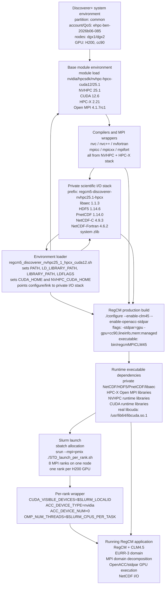

# RegCM on Discoverer+: Software Stack and Benchmark Report

## 1. Software Stack

This report documents the software environment built and validated for running the GPU-enabled RegCM model on the Discoverer+ system. The stack uses the NVIDIA HPC SDK supplied by Discoverer+ together with a private, compiler- and MPI-compatible scientific I/O stack.

Unless otherwise noted, benchmark timings in this report refer to the production `mem:managed` executable at `bin/regcmMPICLM45`. Ongoing `mem:unified` tests use a separate executable and run tree and are reported separately from the production scaling tables.

### 1.0 RegCM on Discoverer+: Validated Software Stack

*NVHPC 25.1 + HPC-X Open MPI + private NetCDF/HDF5/PnetCDF stack + CUDA/NVHPC GPU runtime*

The diagram is intentionally unstyled and uses only ordinary nodes and basic arrows for compatibility with GitHub's Mermaid renderer.



- The private scientific I/O stack avoids mixing incompatible public modules with the NVHPC and HPC-X environment.
- The loader makes the RegCM build and runtime environment reproducible.
- `srun --mpi=pmix` lets Slurm launch the MPI ranks through PMIx and Open MPI.
- The wrapper maps each local MPI rank to one GPU using `SLURM_LOCALID`.

#### Plain-Text Stack Outline

```text
RegCM application/runtime
  RegCM + CLM4.5, EURR-3, MPI decomposition, OpenACC/stdpar, NetCDF I/O
  Validated one-day production run on 8 H200 GPUs
        ^
Per-rank wrapper
  CUDA_VISIBLE_DEVICES=$SLURM_LOCALID
  ACC_DEVICE_TYPE=nvidia, ACC_DEVICE_NUM=0
  OMP_NUM_THREADS=$SLURM_CPUS_PER_TASK
  OMP_PROC_BIND=true, OMP_PLACES=cores
  rank 0 -> GPU 0, rank 1 -> GPU 1, ..., rank 7 -> GPU 7
        ^
Slurm launch
  1 exclusive node, 8 MPI ranks, 8 GPUs, 2 CPUs per task
  srun --mpi=pmix ./STD_launch_per_rank.sh
        ^
Production executable and runtime dependencies
  /valhalla/projects/ehpc-ben-2026b06-085/tchristian/work/RegCM/bin/regcmMPICLM45
  private NetCDF-Fortran, NetCDF-C, HDF5, PnetCDF, and libaec
  system zlib, HPC-X/Open MPI, NVHPC runtime, CUDA 12.6 runtime
  real NVIDIA driver: /usr/lib64/libcuda.so.1
        ^
RegCM production build
  source: /valhalla/projects/ehpc-ben-2026b06-085/tchristian/work/RegCM
  ./configure --enable-clm45 --enable-openacc-stdpar
  -stdpar=gpu -gpu=cc90,lineinfo,mem:managed
        ^
Environment loader
  environment_loader/regcm5_discoverer_nvhpc25_1_hpcx_cuda12.sh
  sets compiler and MPI variables, CUDA_HOME, NVHPC_CUDA_HOME,
  PATH, LD_LIBRARY_PATH, LIBRARY_PATH, LDFLAGS, and private I/O paths
  REGCM_DISCOVERER_USE_MPI_SHIM=1
  REGCM_DISCOVERER_DISABLE_UCC=1
  REGCM_CUDA_STUBS=always
  OMPI_MCA_coll=^ucc
  CUDA stubs used for configure/link checks; real libcuda used at runtime
        ^
Private scientific I/O stack
  prefix: /valhalla/projects/ehpc-ben-2026b06-085/tchristian/software/
          regcm5-discoverer-nvhpc25.1-hpcx
  libaec 1.1.3, HDF5 1.14.6, PnetCDF 1.14.0,
  NetCDF-C 4.9.3, NetCDF-Fortran 4.6.2, /usr/lib64/libz.so
  built with the same NVHPC and HPC-X wrappers used for RegCM
        ^
Compiler and MPI wrapper layer
  nvc, nvc++, nvfortran, mpicc, mpicxx, mpifort
  MPI wrappers from HPC-X/Open MPI, not GCC/LLVM Open MPI
        ^
Base module environment
  module purge
  module load nvidia/hpcsdk/nvhpc-hpcx-cuda12/25.1
  NVHPC 25.1, CUDA 12.6, HPC-X 2.21, Open MPI 4.1.7rc1
        ^
Discoverer+ system environment
  partition: common, account/QoS: ehpc-ben-2026b06-085
  compute nodes: dgx1/dgx2, NVIDIA H200, compute capability 9.0, cc90
```

Public Discoverer+ HDF5 and NetCDF modules were avoided because they pull a different compiler/MPI stack. The private libraries were built with the same NVHPC and HPC-X wrappers used for RegCM. Production timings refer to the `mem:managed` executable. The separate experimental `mem:unified` executable and run tree are documented later in this report.

### 1.1 Platform

| Item | Configuration |
|---|---|
| System | Discoverer+ |
| Slurm partition | `common` |
| Project account | `ehpc-ben-2026b06-085` |
| Project QoS | `ehpc-ben-2026b06-085` |
| GPU | NVIDIA H200 |
| GPU compute capability | 9.0 |
| RegCM GPU target | `cc90` |
| Project maximum walltime | `02:00:00` per job |

The H200 architecture was verified on a compute node. RegCM's NVHPC GPU architecture setting was therefore changed from `ccnative` to `cc90` in `configure.ac` and the generated `configure` script.

### 1.2 Compiler, CUDA, and MPI

The base programming environment is loaded with:

```bash
module purge
module load nvidia/hpcsdk/nvhpc-hpcx-cuda12/25.1
```

The module provides the following toolchain:

| Component | Version or selection |
|---|---|
| NVIDIA HPC SDK | 25.1 |
| C compiler | `nvc` |
| C++ compiler | `nvc++` |
| Fortran compiler | `nvfortran` |
| CUDA toolkit | 12.6 |
| HPC-X | 2.21 |
| MPI implementation | HPC-X Open MPI 4.1.7rc1 |
| MPI C wrapper | `mpicc` |
| MPI Fortran wrapper | `mpifort` |

The CUDA installation used at build and runtime is:

```text
/weka/software/nvidia/packages/hpc_sdk/Linux_x86_64/25.1/cuda/12.6
```

The loader explicitly sets both `CUDA_HOME` and `NVHPC_CUDA_HOME` to this location.

### 1.3 Private Scientific I/O Stack

The public Discoverer+ HDF5 and NetCDF modules were not used because the available modules pull compiler and MPI dependencies based on LLVM/GCC Open MPI. Mixing those modules with NVHPC and HPC-X would produce an inconsistent compiler/MPI stack.

Instead, the required libraries were built privately using the same NVHPC 25.1 and HPC-X wrappers as RegCM.

Installation prefix:

```text
/valhalla/projects/ehpc-ben-2026b06-085/tchristian/software/regcm5-discoverer-nvhpc25.1-hpcx
```

| Library | Version | Important build properties |
|---|---:|---|
| libaec | 1.1.3 | Shared library, built with `nvc` |
| HDF5 | 1.14.6 | Shared, high-level, parallel, and Fortran interfaces enabled |
| Parallel-NetCDF | 1.14.0 | Shared library and Fortran interface enabled |
| NetCDF-C | 4.9.3 | NetCDF-4 and PnetCDF support enabled; DAP disabled |
| NetCDF-Fortran | 4.6.2 | Shared library built with `mpifort` |
| zlib | Discoverer system library | `/usr/lib64/libz.so` |

HDF5, PnetCDF, NetCDF-C, and NetCDF-Fortran were built with the HPC-X wrappers `mpicc`, `mpicxx`, and `mpifort`. The system zlib was retained because HPC-X/Open MPI requires the system library's versioned `ZLIB_*` symbols. Stale libtool `.la` files were removed to avoid invalid absolute MPI dependency paths.

The dependency build script is:

```text
environment_loader/build_regcm5_discoverer_deps.sh
```

The private stack build completed successfully in Slurm job `178394`.

### 1.4 Environment Loader

The validated loader is:

```text
/valhalla/projects/ehpc-ben-2026b06-085/tchristian/work/RegCM/environment_loader/regcm5_discoverer_nvhpc25_1_hpcx_cuda12.sh
```

Its main responsibilities are:

- Purge inherited modules and load NVHPC 25.1 with CUDA 12.6 and HPC-X.
- Select `nvc`, `nvc++`, and `nvfortran` as the serial compilers.
- Select `mpicc` and `mpifort` as the MPI wrappers.
- Locate the NVHPC, CUDA, compiler runtime, and mathematical library directories.
- Add the private HDF5/NetCDF/PnetCDF prefix to the executable, include, link, and runtime search paths.
- Make CUDA stub libraries available for configure and link checks through `LIBRARY_PATH` and `LDFLAGS`.
- Keep CUDA stubs out of `LD_LIBRARY_PATH`, allowing compute-node runs to resolve the real NVIDIA driver library at `/usr/lib64/libcuda.so.1`.
- Validate the required compilers, MPI wrappers, and I/O configuration tools.

The loader currently defaults to an Open MPI shim and disables UCC collectives:

```bash
export REGCM_DISCOVERER_USE_MPI_SHIM=1
export REGCM_DISCOVERER_DISABLE_UCC=1
export REGCM_CUDA_STUBS=always
```

The shim is installed at:

```text
/valhalla/projects/ehpc-ben-2026b06-085/tchristian/software/discoverer-hpcx-2.21-ompi-shim
```

With UCC disabled, the loader exports:

```bash
export OMPI_MCA_coll=^ucc
```

Later ablation experiments showed that the shim, UCC setting, and CUDA stub policy did not materially change performance for the tested single-node, eight-GPU case. They are therefore retained as validated defaults rather than demonstrated performance requirements.

### 1.5 RegCM Build

The RegCM executable used for the successful runs reports revision `27e37e-dirty`, indicating local source/build changes relative to the recorded Git revision. The exact working-tree diff should be archived or committed for a fully reproducible release record.

RegCM was configured with:

```bash
./configure --enable-clm45 --enable-openacc-stdpar
```

The benchmark executable was built with NVHPC standard parallelism targeting the H200 architecture and the managed-memory model:

```text
-stdpar=gpu -gpu=cc90,lineinfo,mem:managed
```

All production timings in this report therefore correspond to the `mem:managed` binary. Results should not be mixed with future `mem:unified` experiments unless those binaries and run directories are reported separately.

The successful production executable was built without RegCM's `--enable-pnetcdf` option. PnetCDF remains installed and is enabled in NetCDF-C, so `libpnetcdf` can still appear in the executable's transitive runtime dependencies. The production namelist used parallel NetCDF input (`do_parallel_netcdf_in = .true.`) and serial NetCDF output (`do_parallel_netcdf_out = .false.`).

The resulting executable is:

```text
/valhalla/projects/ehpc-ben-2026b06-085/tchristian/work/RegCM/bin/regcmMPICLM45
```

The successful no-PnetCDF RegCM build and installation completed in Slurm job `178620`.

### 1.6 Runtime Configuration

The validated single-node launch uses one MPI rank per GPU:

```text
8 MPI ranks x 1 H200 GPU per rank
```

Each rank is assigned a GPU using `SLURM_LOCALID`:

```bash
export CUDA_VISIBLE_DEVICES=$SLURM_LOCALID
export ACC_DEVICE_TYPE=nvidia
export ACC_DEVICE_NUM=0
```

The application is launched through Slurm PMIx support:

```bash
srun --mpi=pmix ./STD_launch_per_rank.sh
```

The standard eight-GPU production script requests:

```text
nodes             = 1
tasks per node    = 8
CPUs per task     = 2
GPUs              = 8
exclusive node    = yes
```

OpenMP settings are:

```bash
export OMP_NUM_THREADS=$SLURM_CPUS_PER_TASK
export OMP_PROC_BIND=true
export OMP_PLACES=cores
```

### 1.7 Stack Validation

The stack was validated with the EURR-3 domain (`1003 x 1003 x 50`) for a one-day simulation with hourly I/O on eight H200 GPUs. Reference job `178785` completed successfully on `dgx1`:

| Metric | Result |
|---|---:|
| RegCM total elapsed time | 534.01 seconds |
| RegCM average elapsed time per simulated day | 534.01 seconds/day |
| MPI ranks | 8 |
| Final model time | `2009-09-02 00:00:00 UTC` |
| Result | Successful completion |

Runtime dependency inspection confirmed that the executable loaded:

- NetCDF-Fortran, NetCDF-C, HDF5, libaec, and PnetCDF from the private prefix.
- MPI libraries from HPC-X/Open MPI.
- NVHPC and CUDA 12.6 runtime libraries from the NVIDIA HPC SDK installation.
- The real compute-node NVIDIA driver library from `/usr/lib64/libcuda.so.1`.

## 2. Benchmark Configuration

### 2.1 System Topology

Discoverer+ exposes two DGX H200 GPU nodes in the `common` Slurm partition:

| Item | Configuration |
|---|---:|
| Slurm cluster | `disco-plus` |
| Partition | `common` |
| Nodes | `dgx1`, `dgx2` |
| GPUs per node | 8 x NVIDIA H200 SXM |
| HBM per GPU | 141 GB HBM3e |
| Host CPUs per node | 2 x Intel Xeon Platinum 8480C |
| CPU cores per node | 112 |
| Host memory per node | 2 TB DDR5 |

The documented intra-node GPU fabric is NVLink 4.0 plus NVSwitch:

| Item | Configuration |
|---|---:|
| NVLink connections | 18 per GPU |
| Per-GPU bidirectional GPU interconnect bandwidth | 900 GB/s |
| NVSwitches | 4 per DGX H200 node |
| Aggregate bidirectional GPU-to-GPU bandwidth | 7.2 TB/s |

The documented inter-node network is 10 x ConnectX-7 adapters per node, each capable of 400 Gb/s InfiniBand/Ethernet. Therefore, runs up to 8 GPUs remain within a single NVSwitch-connected DGX node, while 12- and 14-GPU runs span `dgx1` and `dgx2` and communicate over the inter-node fabric.

### 2.2 Domain and Namelist

All production benchmarks used the EURR-3 domain:

| Parameter | Value |
|---|---:|
| `iy` | 1003 |
| `jx` | 1003 |
| `kz` | 50 |
| Horizontal grid spacing | approximately 3.336 km |
| Timestep | 45 s |
| Calendar | Gregorian |
| Initial date | `2009-09-01 00:00:00 UTC` |

The 3-day production namelist used:

```text
mdate1 = 2009090100
mdate2 = 2009090400
```

The 7-day production namelist used:

```text
mdate1 = 2009090100
mdate2 = 2009090800
```

The output configuration enabled hourly CORDEX-style I/O:

| Output option | Value |
|---|---:|
| `ifcordex` | `.true.` |
| `ifatm` | `.true.` |
| `atmfrq` | 1.0 hour |
| `ifrad` | `.true.` |
| `radfrq` | 1.0 hour |
| `ifsrf` | `.true.` |
| `srffrq` | 1.0 hour |
| `ifsts` | `.true.` |
| `ifsave` | `.true.` |
| `do_parallel_netcdf_in` | `.true.` |
| `do_parallel_netcdf_out` | `.false.` |

Large NetCDF output files were deleted after validation to recover project storage. Slurm accounting records and production logs are the durable benchmark artifacts.

### 2.3 Run Matrix

The production `mem:managed` run trees are located under:

```text
Benchmark/production_runs/Discoverer_3day_with_IO
Benchmark/production_runs/Discoverer_7day_with_IO
```

The separate `mem:unified` experiment tree is:

```text
Benchmark/production_runs/Discoverer_mem_unified_tests
```

Each production `mem:managed` run directory uses the same loader, executable, per-rank GPU wrapper, and one-rank-per-GPU launch pattern. The `mem:unified` experiment tree reuses the same loader and launch pattern but uses its separate `mem:unified` executable. Each run writes to a unique scratch output directory under:

```text
/valhalla/projects/ehpc-ben-2026b06-085/tchristian/scratch/EURR3/output_from_runs
```

| GPUs | MPI layout | Node layout | 3-day status | 7-day status |
|---:|---|---|---|---|
| 1 | 1 rank x 1 GPU | 1 node | Failed/intermittent diagnostic timeout | Not used for final 7-day matrix |
| 2 | 2 ranks x 1 GPU | 1 node | Completed | Timed out at 2-hour project limit |
| 4 | 4 ranks x 1 GPU | 1 node | Completed | Completed |
| 8 | 8 ranks x 1 GPU | 1 node | Completed | Completed |
| 12 | 12 ranks x 1 GPU | 2 nodes, 6 ranks per node | Completed | Completed |
| 14 | 14 ranks x 1 GPU | 2 nodes, 7 ranks per node | Completed after rerun | Completed |
| 16 | 16 ranks x 1 GPU | 2 nodes, 8 ranks per node | Slurm rejected request | Not used |
| 32 | 32 ranks x 1 GPU | More than visible allocation | Infeasible | Not used |

The 16-GPU request used `--nodes=2`, `--ntasks-per-node=8`, and `--gres=gpu:8`. Slurm rejected it at submission time with:

```text
Batch job submission failed: Requested node configuration is not available
```

This is consistent with the current visible GRES shape, where `dgx1` exposes 8 normal GPUs but `dgx2` exposes 7 normal `gpu` GRES plus one separate `gpu_biz` GRES.

## 3. Benchmark Results

### 3.1 One-Day Stack Validation

The one-day eight-GPU validation job established that the software stack, executable, I/O libraries, and runtime loader were usable for a full production-style simulation.

| GPUs | Job | State | RegCM elapsed | RegCM avg/day | Final model time |
|---:|---:|---|---:|---:|---|
| 8 | `178785` | Completed | 534.01 s | 534.01 s/day | `2009-09-02 00:00:00 UTC` |

### 3.2 Three-Day Production Results

The full successful 3-day runs produced approximately 204 GiB of NetCDF output each before the output files were deleted to recover storage.

| GPUs | Job | State | RegCM elapsed | RegCM avg/day | Timelimit | Nodes | Notes |
|---:|---:|---|---:|---:|---:|---|---|
| 1 | `178818` | Failed | n/a | n/a | `02:00:00` | `dgx1` | Accelerator fatal error at `radinp`, line 3385 |
| 1 | `178949` | Timeout | 4732.83 s partial | 4732.83 s/day partial | `02:00:00` | `dgx2` | Diagnostic run passed the fatal point and reached about 27 model hours |
| 1 | `179008` | Failed | n/a | n/a | `02:00:00` | `dgx1` | Reproduced the `radinp` fatal error |
| 1 | `179049` | Failed | n/a | n/a | `02:00:00` | `dgx2` | Reproduced the `radinp` fatal error with explicit `--nodelist=dgx2` |
| 2 | `178819` | Completed | 5417.04 s | 1805.68 s/day | `02:00:00` | `dgx1` | Full 3-day run |
| 4 | `178820` | Completed | 2599.73 s | 866.58 s/day | `01:00:00` | `dgx2` | Full 3-day run |
| 8 | `178821` | Completed | 1371.81 s | 457.27 s/day | `00:35:00` | `dgx1` | Full 3-day run |
| 12 | `178823` | Completed | 1162.89 s | 387.63 s/day | `00:25:00` | `dgx[1-2]` | Full 3-day run |
| 14 | `178824` | Timeout | 963.64 s partial | 481.82 s/day partial | `00:20:00` | `dgx[1-2]` | Initial walltime was too short |
| 14 | `178923` | Completed | 1371.92 s | 457.31 s/day | `00:30:00` | `dgx[1-2]` | Successful rerun |

Scaling relative to the completed 2-GPU 3-day run:

| GPUs | Completed job | RegCM elapsed seconds | RegCM avg/day | RegCM speedup vs 2 GPUs | RegCM efficiency vs 2 GPUs |
|---:|---:|---:|---:|---:|---:|
| 2 | `178819` | 5417.04 | 1805.68 s/day | 1.00x | 100% |
| 4 | `178820` | 2599.73 | 866.58 s/day | 2.08x | 104% |
| 8 | `178821` | 1371.81 | 457.27 s/day | 3.95x | 99% |
| 12 | `178823` | 1162.89 | 387.63 s/day | 4.66x | 78% |
| 14 | `178923` | 1371.92 | 457.31 s/day | 3.95x | 56% |

The 12-GPU case was the fastest completed 3-day run. The 14-GPU case remained valid but was slower than 12 GPUs, indicating that additional inter-node decomposition and communication did not improve this workload at that scale.

### 3.3 Seven-Day Production Results

The full successful 7-day runs produced approximately 424 GiB of NetCDF output each before the output files were deleted to recover storage.

| GPUs | Job | State | RegCM elapsed | RegCM avg/day | Timelimit | Nodes | Notes |
|---:|---:|---|---:|---:|---:|---|---|
| 2 | `179056` | Timeout | 5334.50 s partial | 1778.17 s/day partial | `02:00:00` | `dgx1` | Reached about `2009-09-04 16:00:00 UTC` |
| 4 | `179057` | Completed | 5852.88 s | 836.13 s/day | `02:00:00` | `dgx2` | Full 7-day run |
| 8 | `179001` | Completed | 3057.76 s | 436.82 s/day | `01:15:00` | `dgx1` | Full 7-day run |
| 12 | `179058` | Completed | 2552.77 s | 364.68 s/day | `01:00:00` | `dgx[1-2]` | Full 7-day run |
| 14 | `179059` | Completed | 3126.28 s | 446.61 s/day | `01:00:00` | `dgx[1-2]` | Full 7-day run |

Scaling relative to the completed 4-GPU 7-day run:

| GPUs | Completed job | RegCM elapsed seconds | RegCM avg/day | RegCM speedup vs 4 GPUs | RegCM efficiency vs 4 GPUs |
|---:|---:|---:|---:|---:|---:|
| 4 | `179057` | 5852.88 | 836.13 s/day | 1.00x | 100% |
| 8 | `179001` | 3057.76 | 436.82 s/day | 1.91x | 96% |
| 12 | `179058` | 2552.77 | 364.68 s/day | 2.29x | 76% |
| 14 | `179059` | 3126.28 | 446.61 s/day | 1.87x | 53% |

The 12-GPU case was also the fastest completed 7-day run. The 2-GPU run did not fit inside the project hard walltime limit, while the 4-GPU run completed with about 22 minutes of margin.

### 3.4 Preliminary mem:unified Experiments

The `mem:unified` tests were performed with an isolated RegCM build and executable so that the existing production `mem:managed` executable remained unchanged.

```text
Build tree: /valhalla/projects/ehpc-ben-2026b06-085/tchristian/work/RegCM_mem_unified_build
Executable: /valhalla/projects/ehpc-ben-2026b06-085/tchristian/work/RegCM/bin/mem_unified/regcmMPICLM45
Run tree:   Benchmark/production_runs/Discoverer_mem_unified_tests
```

The isolated build used NVHPC standard parallelism with unified memory targeting H200:

```text
-stdpar=gpu -gpu=cc90,lineinfo,mem:unified -Minfo=accel
```

The 1-day `mem:unified` validation status is:

| GPUs | Job | State | RegCM elapsed | Avg. RegCM time per simulated day | Final model time | Notes |
|---:|---:|---|---:|---:|---|---|
| 1 | `179446` | Failed | n/a | n/a | n/a | Reproduced the `radinp` accelerator fatal error on `dgx2` |
| 8 | `179063` | Completed | 665.04 s | 665.04 s/day | `2009-09-02 00:00:00 UTC` | Full 1-day run |

The preliminary 7-day `mem:unified` status is:

| GPUs | Job | State | RegCM elapsed | Avg. RegCM time per simulated day | Notes |
|---:|---:|---|---:|---:|---|
| 2 | `179445` | Pending | n/a | n/a | Had `NODE_FAIL` attempts on `dgx1` and `dgx2`; pending another restart |
| 4 | `179121` | Completed | 6720.56 s | 960.08 s/day | Full 7-day run |
| 8 | `179253` | Completed | 3910.62 s | 558.66 s/day | Full 7-day run |
| 12 | `179118` | Completed | 3379.38 s | 482.77 s/day | Full 7-day run |
| 14 | `179254` | Completed | 3819.20 s | 545.60 s/day | Full 7-day run after increasing walltime to `01:30:00` |

The completed 7-day runs common to both memory modes compare as follows:

| GPUs | `mem:managed` job | `mem:managed` RegCM elapsed | `mem:managed` avg. per day | `mem:unified` job | `mem:unified` RegCM elapsed | `mem:unified` avg. per day |
|---:|---:|---:|---:|---:|---:|---:|
| 4 | `179057` | 5855.11 s | 836.44 s/day | `179121` | 6720.56 s | 960.08 s/day |
| 8 | `179001` | 3059.68 s | 437.10 s/day | `179253` | 3910.62 s | 558.66 s/day |
| 12 | `179058` | 2554.67 s | 364.95 s/day | `179118` | 3379.38 s | 482.77 s/day |
| 14 | `179059` | 3128.16 s | 446.88 s/day | `179254` | 3819.20 s | 545.60 s/day |

The 1-GPU `mem:unified` run reproduced the same `radinp` accelerator fatal error seen in the `mem:managed` 1-GPU cases. The 2-GPU `mem:unified` attempts have not established a RegCM model failure; they failed through Slurm node failures or pre-launch `srun` errors, so the 2-GPU `mem:unified` result remains unresolved until job `179445` completes.

## 4. Runtime Investigation and Known Issues

### 4.1 One-GPU Fatal Error

The one-GPU 3-day case repeatedly failed in `radinp` with the following NVHPC accelerator runtime message:

```text
Accelerator Fatal Error: This file was compiled: -acc=gpu -gpu=cc90
Rebuild this file with -gpu=cc90 to use NVIDIA Tesla GPU 0
File: .../Main/radlib/mod_rad_radiation.F90
Function: radinp:1214
Line: 3385
```

This was observed on both `dgx1` and `dgx2`. A diagnostic run with `NVCOMPILER_ACC_NOTIFY=3` on `dgx2` passed the same kernel location and continued until the 2-hour walltime limit, showing that the failure is not completely deterministic. That diagnostic stderr file grew to approximately 2.2 GB and was deleted after confirming that it did not contain the fatal signature. The later 1-day, 1-GPU `mem:unified` run `179446` also failed at `radinp`, line 3385, so unified memory did not remove this single-rank failure mode.

The failing configuration uses a single MPI rank and therefore `CPUS DIM1 = 1`, `CPUS DIM2 = 1`. Multi-rank configurations from 2 GPUs upward completed the 3-day run, so the failure appears specific to the single-rank/full-domain execution path or to an intermittent NVHPC/OpenACC/stdpar runtime behavior exposed by that path.

### 4.2 Walltime Limit

The project QoS imposes a hard job walltime limit of `02:00:00`. This directly affected the slowest production cases:

| Case | Job | Outcome |
|---|---:|---|
| 3-day 1-GPU diagnostic | `178949` | Timed out after reaching about 27 model hours |
| 7-day 2-GPU | `179056` | Timed out after reaching about `2009-09-04 16:00:00 UTC` |

The 7-day 4-GPU run completed inside the limit in `01:37:56`, making it the smallest completed 7-day configuration under the current QoS.

### 4.3 Multi-Node Resource Shape

Discoverer+ exposes only two GPU nodes to this project/account. Therefore, 32 GPUs are not available. A 16-GPU normal-GRES request was also rejected because the two visible nodes do not both expose 8 normal `gpu` GRES at the time of testing:

```text
dgx1: gpu:8
dgx2: gpu:7,gpu_biz:1
```

The separate `gpu_biz` GRES type is not documented in the local offline Discoverer+ documentation reviewed during this benchmark work. Its intended use should be confirmed with system support before attempting to consume it.

### 4.4 Discoverer+ Node Introspection and mem:unified Probe

A Discoverer+ node introspection job was run on `dgx1` to capture the compute-node topology and to probe the practical `mem:unified` runtime path:

| Item | Result |
|---|---|
| Job | `179466` |
| Node | `dgx1` |
| State | Completed, exit code `0:0` |
| Elapsed | `00:01:16` |
| GPUs | 8 x NVIDIA H200, compute capability 9.0 |
| Driver | NVIDIA `565.57.01` |
| Kernel | `5.14.0-427.42.1.el9_4.x86_64` |
| NVIDIA kernel module | Open kernel module, `565.57.01` |

The upstream-version heuristic for full Linux HMM support failed because the node runs a vendor `5.14` kernel rather than an upstream `6.1.24+`, `6.2.11+`, or `6.3+` kernel. However, the actual kernel and driver artifacts showed HMM-related support:

```text
CONFIG_MMU_NOTIFIER=y
CONFIG_HMM_MIRROR=y
CONFIG_DEVICE_PRIVATE=y
hmm_range_fault present
DRIVER_HEURISTIC=PASS_DRIVER_535_OR_NEWER
```

The initial practical NVHPC probe compiled and ran successfully with:

```text
nvc++ -acc -gpu=cc90,lineinfo,mem:unified -Minfo=accel
MEM_UNIFIED_RUNTIME_PROBE=PASS
```

That initial OpenACC probe is useful evidence that the `mem:unified` compile/runtime path works on the allocated node, but the compiler reported an implicit copy for the test array. Therefore, it does not by itself prove pure pageable host-memory demand paging through HMM. A stricter CUDA-level pageable host-memory probe was added afterward to avoid OpenACC data-management inference.

The `dgx1` topology showed 8 H200 GPUs connected pairwise by `NV18`, with GPUs `0-3` associated with NUMA node 0 and GPUs `4-7` associated with NUMA node 1. The node exposed 12 mlx5 NICs in `nvidia-smi topo -m`.

Follow-up introspection jobs with the stricter CUDA pageable-memory probe were submitted:

| Job | Target | Request | State at report update |
|---:|---|---|---|
| `179509` | `dgx1` | 8 normal GPUs | Pending |
| `179510` | `dgx2` | 7 normal GPUs | Pending |

The `dgx2` follow-up uses 7 normal GPUs because Slurm rejected an 8 normal-GPU request on `dgx2`, consistent with the observed `gpu:7,gpu_biz:1` resource shape.

### 4.5 Output Data Management

The benchmark output volume is large:

| Run length | Typical complete output size |
|---|---:|
| 3 days | approximately 204 GiB per completed run |
| 7 days | approximately 424 GiB per completed run |

After validating completion and collecting timings, generated NetCDF files were removed from selected completed and partial output directories to recover storage. The run directories, Slurm logs, namelists, launch scripts, and output symlinks were retained.

### 4.6 Ablation Tests

Earlier single-node, eight-GPU ablation experiments tested loader/runtime variants including the MPI shim, UCC collective disabling, and CUDA stub policy. These did not materially change performance for the tested one-day, eight-GPU case. The current loader retains the conservative validated defaults because they produced a consistent build and runtime environment across the production runs.
