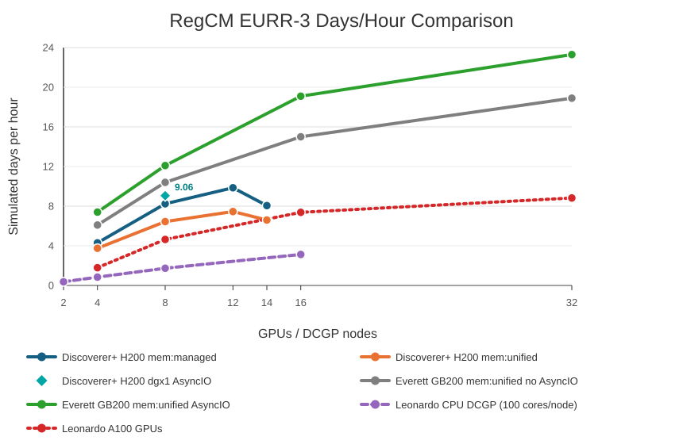

# RegCM on Discoverer+: Software Stack and Benchmark Report

## 1. Software Stack

This report documents the software environment built and validated for running the GPU-enabled RegCM model on the Discoverer+ system. The stack uses the NVIDIA HPC SDK supplied by Discoverer+ together with a private, compiler- and MPI-compatible scientific I/O stack.

Unless otherwise noted, benchmark timings in this report refer to the production `mem:managed` executable at `bin/regcmMPICLM45`. Ongoing `mem:unified` tests use a separate executable and run tree and are reported separately from the production scaling tables.

### 1.0 RegCM on Discoverer+: Validated Software Stack

The runtime stack is intentionally kept to one compiler/MPI family plus a private scientific I/O stack built with that same family.

Dependency order:

1. Discoverer+ compute node: H200 GPUs, `cc90`, real NVIDIA driver library at `/usr/lib64/libcuda.so.1`.
2. NVIDIA HPC SDK module: `nvidia/hpcsdk/nvhpc-hpcx-cuda12/25.1`, providing NVHPC 25.1, CUDA 12.6, HPC-X 2.21, and Open MPI 4.1.7rc1.
3. Compiler and MPI wrappers from that module: `nvc`, `nvc++`, `nvfortran`, `mpicc`, `mpicxx`, and `mpifort`.
4. Private I/O stack built with those wrappers: libaec, HDF5, PnetCDF, NetCDF-C, NetCDF-Fortran, plus system zlib.
5. RegCM environment loader: `environment_loader/regcm5_discoverer_nvhpc25_1_hpcx_cuda12.sh`, which loads the module and points build/runtime paths to the private I/O stack.
6. RegCM executable: production `mem:managed` binary at `bin/regcmMPICLM45`; separate experimental `mem:unified` binary at `bin/mem_unified/regcmMPICLM45`.
7. Slurm launch layer: `sbatch` allocation plus `srun --mpi=pmix` running one MPI rank per GPU.
8. Per-rank wrapper: sets `CUDA_VISIBLE_DEVICES=$SLURM_LOCALID`, `ACC_DEVICE_TYPE=nvidia`, `ACC_DEVICE_NUM=0`, and OpenMP placement variables.
9. Running application: RegCM with CLM4.5 on the EURR-3 domain, using MPI decomposition, GPU offload/stdpar execution, and NetCDF I/O.

Public Discoverer+ HDF5 and NetCDF modules were avoided because they pull a different compiler/MPI stack. The private libraries were built with the same NVHPC and HPC-X wrappers used for RegCM.

### 1.1 Platform

<a id="table-1"></a>

**Table 1. Discoverer+ benchmark platform configuration.**

| Item | Configuration |
|---|---|
| System | Discoverer+ |
| Slurm partition | `common` |
| Project account | `ehpc-ben-2026b06-085` |
| Project QoS | `ehpc-ben-2026b06-085` |
| GPU | NVIDIA H200 |
| GPU compute capability | 9.0 |
| RegCM GPU target | `cc90` |
| Project maximum walltime | `02:00:00` per job |

The H200 architecture was verified on a compute node. RegCM's NVHPC GPU architecture setting was therefore changed from `ccnative` to `cc90` in `configure.ac` and the generated `configure` script.

### 1.2 Compiler, CUDA, and MPI

The base programming environment is loaded with:

```bash
module purge
module load nvidia/hpcsdk/nvhpc-hpcx-cuda12/25.1
```

The module provides the following toolchain:

<a id="table-2"></a>

**Table 2. Compiler, CUDA, and MPI toolchain versions.**

| Component | Version or selection |
|---|---|
| NVIDIA HPC SDK | 25.1 |
| C compiler | `nvc` |
| C++ compiler | `nvc++` |
| Fortran compiler | `nvfortran` |
| CUDA toolkit | 12.6 |
| HPC-X | 2.21 |
| MPI implementation | HPC-X Open MPI 4.1.7rc1 |
| MPI C wrapper | `mpicc` |
| MPI Fortran wrapper | `mpifort` |

The CUDA installation used at build and runtime is:

```text
/weka/software/nvidia/packages/hpc_sdk/Linux_x86_64/25.1/cuda/12.6
```

The loader explicitly sets both `CUDA_HOME` and `NVHPC_CUDA_HOME` to this location.

### 1.3 Private Scientific I/O Stack

The public Discoverer+ HDF5 and NetCDF modules were not used because the available modules pull compiler and MPI dependencies based on LLVM/GCC Open MPI. Mixing those modules with NVHPC and HPC-X would produce an inconsistent compiler/MPI stack.

Instead, the required libraries were built privately using the same NVHPC 25.1 and HPC-X wrappers as RegCM.

Installation prefix:

```text
/valhalla/projects/ehpc-ben-2026b06-085/tchristian/software/regcm5-discoverer-nvhpc25.1-hpcx
```

<a id="table-3"></a>

**Table 3. Private scientific I/O stack used by RegCM.**

| Library | Version | Important build properties |
|---|---:|---|
| libaec | 1.1.3 | Shared library, built with `nvc` |
| HDF5 | 1.14.6 | Shared, high-level, parallel, and Fortran interfaces enabled |
| Parallel-NetCDF | 1.14.0 | Shared library and Fortran interface enabled |
| NetCDF-C | 4.9.3 | NetCDF-4 and PnetCDF support enabled; DAP disabled |
| NetCDF-Fortran | 4.6.2 | Shared library built with `mpifort` |
| zlib | Discoverer system library | `/usr/lib64/libz.so` |

HDF5, PnetCDF, NetCDF-C, and NetCDF-Fortran were built with the HPC-X wrappers `mpicc`, `mpicxx`, and `mpifort`. The system zlib was retained because HPC-X/Open MPI requires the system library's versioned `ZLIB_*` symbols. Stale libtool `.la` files were removed to avoid invalid absolute MPI dependency paths.

The dependency build script is:

```text
environment_loader/build_regcm5_discoverer_deps.sh
```

The private stack build completed successfully in Slurm job `178394`.

### 1.4 RegCM Build

The RegCM executable used for the successful runs reports revision `27e37e-dirty`, indicating local source/build changes relative to the recorded Git revision. The exact working-tree diff should be archived or committed for a fully reproducible release record.

RegCM was configured with:

```bash
./configure --enable-clm45 --enable-openacc-stdpar
```

The benchmark executable was built with NVHPC standard parallelism targeting the H200 architecture and the managed-memory model:

```text
-stdpar=gpu -gpu=cc90,lineinfo,mem:managed
```

All production timings in this report therefore correspond to the `mem:managed` binary. Results should not be mixed with future `mem:unified` experiments unless those binaries and run directories are reported separately.

The successful production executable was built without RegCM's `--enable-pnetcdf` option. PnetCDF remains installed and is enabled in NetCDF-C, so `libpnetcdf` can still appear in the executable's transitive runtime dependencies. The production namelist used parallel NetCDF input (`do_parallel_netcdf_in = .true.`) and serial NetCDF output (`do_parallel_netcdf_out = .false.`).

The resulting executable is:

```text
/valhalla/projects/ehpc-ben-2026b06-085/tchristian/work/RegCM/bin/regcmMPICLM45
```

The successful no-PnetCDF RegCM build and installation completed in Slurm job `178620`.

### 1.5 Runtime Configuration

The validated single-node launch uses one MPI rank per GPU:

```text
8 MPI ranks x 1 H200 GPU per rank
```

Each rank is assigned a GPU using `SLURM_LOCALID`:

```bash
export CUDA_VISIBLE_DEVICES=$SLURM_LOCALID
export ACC_DEVICE_TYPE=nvidia
export ACC_DEVICE_NUM=0
```

The application is launched through Slurm PMIx support:

```bash
srun --mpi=pmix ./STD_launch_per_rank.sh
```

The standard eight-GPU production script requests:

```text
nodes             = 1
tasks per node    = 8
CPUs per task     = 2
GPUs              = 8
exclusive node    = yes
```

OpenMP settings are:

```bash
export OMP_NUM_THREADS=$SLURM_CPUS_PER_TASK
export OMP_PROC_BIND=true
export OMP_PLACES=cores
```

## 2. Benchmark Configuration

### 2.1 System Topology

Discoverer+ exposes two DGX H200 GPU nodes in the `common` Slurm partition:

<a id="table-4"></a>

**Table 4. Discoverer+ node resources visible to the benchmark account.**

| Item | Configuration |
|---|---:|
| Slurm cluster | `disco-plus` |
| Partition | `common` |
| Nodes | `dgx1`, `dgx2` |
| GPUs per node | 8 x NVIDIA H200 SXM |
| HBM per GPU | 141 GB HBM3e |
| Host CPUs per node | 2 x Intel Xeon Platinum 8480C |
| CPU cores per node | 112 |
| Host memory per node | 2 TB DDR5 |

The documented intra-node GPU fabric is NVLink 4.0 plus NVSwitch:

<a id="table-5"></a>

**Table 5. Documented intra-node GPU interconnect topology.**

| Item | Configuration |
|---|---:|
| NVLink connections | 18 per GPU |
| Per-GPU bidirectional GPU interconnect bandwidth | 900 GB/s |
| NVSwitches | 4 per DGX H200 node |
| Aggregate bidirectional GPU-to-GPU bandwidth | 7.2 TB/s |

The documented inter-node network is 10 x ConnectX-7 adapters per node, each capable of 400 Gb/s InfiniBand/Ethernet. Therefore, runs up to 8 GPUs remain within a single NVSwitch-connected DGX node, while 12- and 14-GPU runs span `dgx1` and `dgx2` and communicate over the inter-node fabric.

### 2.2 Domain and Namelist

All production benchmarks used the EURR-3 domain:

<a id="table-6"></a>

**Table 6. EURR-3 model domain and timestep configuration.**

| Parameter | Value |
|---|---:|
| `iy` | 1003 |
| `jx` | 1003 |
| `kz` | 50 |
| Horizontal grid spacing | approximately 3.336 km |
| Timestep | 45 s |
| Calendar | Gregorian |
| Initial date | `2009-09-01 00:00:00 UTC` |

The 3-day production namelist used:

```text
mdate1 = 2009090100
mdate2 = 2009090400
```

The 7-day production namelist used:

```text
mdate1 = 2009090100
mdate2 = 2009090800
```

The output configuration enabled hourly CORDEX-style I/O:

<a id="table-7"></a>

**Table 7. Production output and NetCDF I/O configuration.**

| Output option | Value |
|---|---:|
| `ifcordex` | `.true.` |
| `ifatm` | `.true.` |
| `atmfrq` | 1.0 hour |
| `ifrad` | `.true.` |
| `radfrq` | 1.0 hour |
| `ifsrf` | `.true.` |
| `srffrq` | 1.0 hour |
| `ifsts` | `.true.` |
| `ifsave` | `.true.` |
| `do_parallel_netcdf_in` | `.true.` |
| `do_parallel_netcdf_out` | `.false.` |

Large NetCDF output files were deleted after validation to recover project storage. Slurm accounting records and production logs are the durable benchmark artifacts.

## 3. Benchmark Results

### 3.1 Seven-Day Production Results

The full successful 7-day runs produced approximately 424 GiB of NetCDF output each before the output files were deleted to recover storage.

<a id="table-8"></a>

**Table 8. Seven-day `mem:managed` production results.**

| GPUs | Job | State | RegCM elapsed | RegCM avg/day | Timelimit | Nodes | Notes |
|---:|---:|---|---:|---:|---:|---|---|
| 2 | `179056` | Timeout | 5334.50 s partial | 1778.17 s/day partial | `02:00:00` | `dgx1` | Reached about `2009-09-04 16:00:00 UTC` |
| 4 | `179057` | Completed | 5852.88 s | 836.13 s/day | `02:00:00` | `dgx2` | Full 7-day run |
| 8 | `179001` | Completed | 3057.76 s | 436.82 s/day | `01:15:00` | `dgx1` | Full 7-day run |
| 12 | `179058` | Completed | 2552.77 s | 364.68 s/day | `01:00:00` | `dgx[1-2]` | Full 7-day run |
| 14 | `179059` | Completed | 3126.28 s | 446.61 s/day | `01:00:00` | `dgx[1-2]` | Full 7-day run |

Scaling relative to the completed 4-GPU 7-day run:

<a id="table-9"></a>

**Table 9. Seven-day `mem:managed` scaling relative to 4 GPUs.**

| GPUs | Completed job | RegCM elapsed seconds | RegCM avg/day | RegCM speedup vs 4 GPUs | RegCM efficiency vs 4 GPUs |
|---:|---:|---:|---:|---:|---:|
| 4 | `179057` | 5852.88 | 836.13 s/day | 1.00x | 100% |
| 8 | `179001` | 3057.76 | 436.82 s/day | 1.91x | 96% |
| 12 | `179058` | 2552.77 | 364.68 s/day | 2.29x | 76% |
| 14 | `179059` | 3126.28 | 446.61 s/day | 1.87x | 53% |

The 12-GPU case was also the fastest completed 7-day run. The 2-GPU run did not fit inside the project hard walltime limit, while the 4-GPU run completed with about 22 minutes of margin.

### 3.2 Preliminary mem:unified Experiments

The `mem:unified` tests were performed with an isolated RegCM build and executable so that the existing production `mem:managed` executable remained unchanged.

```text
Build tree: /valhalla/projects/ehpc-ben-2026b06-085/tchristian/work/RegCM_mem_unified_build
Executable: /valhalla/projects/ehpc-ben-2026b06-085/tchristian/work/RegCM/bin/mem_unified/regcmMPICLM45
Run tree:   Benchmark/production_runs/Discoverer_mem_unified_tests
```

The isolated build used NVHPC standard parallelism with unified memory targeting H200:

```text
-stdpar=gpu -gpu=cc90,lineinfo,mem:unified -Minfo=accel
```

The 1-day `mem:unified` validation status is:

<a id="table-10"></a>

**Table 10. One-day `mem:unified` validation status.**

| GPUs | Job | State | RegCM elapsed | Avg. RegCM time per simulated day | Final model time | Notes |
|---:|---:|---|---:|---:|---|---|
| 1 | `179446` | Failed | n/a | n/a | n/a | Reproduced the `radinp` accelerator fatal error on `dgx2` |
| 8 | `179063` | Completed | 665.04 s | 665.04 s/day | `2009-09-02 00:00:00 UTC` | Full 1-day run |

The preliminary 7-day `mem:unified` status is:

<a id="table-11"></a>

**Table 11. Preliminary seven-day `mem:unified` status.**

| GPUs | Job | State | RegCM elapsed | Avg. RegCM time per simulated day | Notes |
|---:|---:|---|---:|---:|---|
| 2 | `179445` | Pending | n/a | n/a | Had `NODE_FAIL` attempts on `dgx1` and `dgx2`; pending another restart |
| 4 | `179121` | Completed | 6720.56 s | 960.08 s/day | Full 7-day run |
| 8 | `179253` | Completed | 3910.62 s | 558.66 s/day | Full 7-day run |
| 12 | `179118` | Completed | 3379.38 s | 482.77 s/day | Full 7-day run |
| 14 | `179254` | Completed | 3819.20 s | 545.60 s/day | Full 7-day run after increasing walltime to `01:30:00` |

The completed 7-day runs common to both local Discoverer+ memory modes compare as follows. Everett's `mem:unified` values are the AsyncIO days/hour values digitized from `GB200_EURR3.png`; only matching GPU counts are included in the table. The accompanying plot also includes Everett's previous GB200 series from the same chart.

<a id="table-12"></a>

**Table 12. Seven-day days/hour comparison for local memory modes and Everett AsyncIO.**

| GPUs | `mem:managed` RegCM elapsed | `mem:managed` avg. per day | `mem:managed` days/hour | local `mem:unified` RegCM elapsed | local `mem:unified` avg. per day | local `mem:unified` days/hour | Everett `mem:unified` AsyncIO days/hour |
|---:|---:|---:|---:|---:|---:|---:|---:|
| 4 | 5855.11 s | 836.44 s/day | 4.30 | 6720.56 s | 960.08 s/day | 3.75 | 7.4 |
| 8 | 3059.68 s | 437.10 s/day | 8.24 | 3910.62 s | 558.66 s/day | 6.44 | 12.1 |
| 12 | 2554.67 s | 364.95 s/day | 9.86 | 3379.38 s | 482.77 s/day | 7.46 | n/a |
| 14 | 3128.16 s | 446.88 s/day | 8.06 | 3819.20 s | 545.60 s/day | 6.60 | n/a |

<a id="figure-1"></a>

<p align="center">
  
</p>

<p align="center"><strong>Figure 1. Days/hour comparison for local Discoverer+ memory modes and Everett GB200 results.</strong> Local series use the completed seven-day Discoverer+ runs. Everett's previous and AsyncIO series are approximate values digitized from <code>GB200_EURR3.png</code>.</p>

The 1-GPU `mem:unified` run reproduced the same `radinp` accelerator fatal error seen in the `mem:managed` 1-GPU cases. The 2-GPU `mem:unified` attempts have not established a RegCM model failure; they failed through Slurm node failures or pre-launch `srun` errors, so the 2-GPU `mem:unified` result remains unresolved until job `179445` completes.

### 3.3 External GB200 EURR-3 Comparison

The file `Benchmark_Reports/GB200_EURR3.png` contains Everett's previous GB200 EURR-3 results and an AsyncIO dataset. The values below are approximate days/hour values digitized from that chart, not timings re-derived from local RegCM logs.

<a id="table-13"></a>

**Table 13. External GB200 EURR-3 comparison digitized from `GB200_EURR3.png`.**

| GPUs | Everett / previous result | AsyncIO result | AsyncIO speedup vs Everett |
|---:|---:|---:|---:|
| 4 | 6.1 days/hour | 7.4 days/hour | 1.21x |
| 8 | 10.4 days/hour | 12.1 days/hour | 1.16x |
| 16 | 15.0 days/hour | 19.1 days/hour | 1.27x |
| 32 | 18.9 days/hour | 23.3 days/hour | 1.23x |

## 4. Runtime Investigation and Known Issues

### 4.1 One-GPU Fatal Error

The one-GPU 3-day case repeatedly failed in `radinp` with the following NVHPC accelerator runtime message:

```text
Accelerator Fatal Error: This file was compiled: -acc=gpu -gpu=cc90
Rebuild this file with -gpu=cc90 to use NVIDIA Tesla GPU 0
File: .../Main/radlib/mod_rad_radiation.F90
Function: radinp:1214
Line: 3385
```

This was observed on both `dgx1` and `dgx2`. A diagnostic run with `NVCOMPILER_ACC_NOTIFY=3` on `dgx2` passed the same kernel location and continued until the 2-hour walltime limit, showing that the failure is not completely deterministic. That diagnostic stderr file grew to approximately 2.2 GB and was deleted after confirming that it did not contain the fatal signature. The later 1-day, 1-GPU `mem:unified` run `179446` also failed at `radinp`, line 3385, so unified memory did not remove this single-rank failure mode.

The failing configuration uses a single MPI rank and therefore `CPUS DIM1 = 1`, `CPUS DIM2 = 1`. Multi-rank configurations from 2 GPUs upward completed the 3-day run, so the failure appears specific to the single-rank/full-domain execution path or to an intermittent NVHPC/OpenACC/stdpar runtime behavior exposed by that path.

### 4.2 Walltime Limit

The project QoS imposes a hard job walltime limit of `02:00:00`. This directly affected the slowest production cases:

<a id="table-14"></a>

**Table 14. Benchmark cases affected by the two-hour project walltime limit.**

| Case | Job | Outcome |
|---|---:|---|
| 3-day 1-GPU diagnostic | `178949` | Timed out after reaching about 27 model hours |
| 7-day 2-GPU | `179056` | Timed out after reaching about `2009-09-04 16:00:00 UTC` |

The 7-day 4-GPU run completed inside the limit in `01:37:56`, making it the smallest completed 7-day configuration under the current QoS.

### 4.3 Multi-Node Resource Shape

Discoverer+ exposes only two GPU nodes to this project/account. Therefore, 32 GPUs are not available. A 16-GPU normal-GRES request was also rejected because the two visible nodes do not both expose 8 normal `gpu` GRES at the time of testing:

```text
dgx1: gpu:8
dgx2: gpu:7,gpu_biz:1
```

The separate `gpu_biz` GRES type is not documented in the local offline Discoverer+ documentation reviewed during this benchmark work. Its intended use should be confirmed with system support before attempting to consume it. A later node-specific introspection job confirmed that an explicit `dgx2` request with `--gres=gpu:7` starts successfully and exposes `CUDA_VISIBLE_DEVICES=0,1,2,3,4,5,6`, while `nvidia-smi` still reports the full 8 H200 devices on the node.

### 4.4 Discoverer+ Node Introspection

Discoverer+ node introspection jobs were run on `dgx1` and `dgx2` to capture compute-node topology, network layout, and the practical `mem:unified` runtime path:

The archived introspection artifacts are stored under:

```text
Discoverer_node_introspection/runs/179466_dgx1_8gpu_initial_openacc_probe
Discoverer_node_introspection/runs/179509_dgx1_8gpu_strict_cuda_hmm_probe
Discoverer_node_introspection/runs/179836_dgx2_7gpu_strict_cuda_hmm_probe
```

#### 4.4.1 Compute and Network Hardware

<a id="table-15"></a>

**Table 15. Compute and GPU hardware observed in node introspection.**

| Item | `dgx1` introspection | `dgx2` introspection |
|---|---|---|
| Reference job | `179466`, completed `0:0` in `00:01:16` | `179836`, completed `0:0` in `00:01:32` |
| Slurm GPU allocation | `SLURM_GPUS_ON_NODE=8`, `CUDA_VISIBLE_DEVICES=0,1,2,3,4,5,6,7` | `SLURM_GPUS_ON_NODE=7`, `CUDA_VISIBLE_DEVICES=0,1,2,3,4,5,6` |
| Physical GPUs reported by `nvidia-smi` | 8 x NVIDIA H200 | 8 x NVIDIA H200 |
| GPU framebuffer memory | 143771 MiB per GPU | 143771 MiB per GPU |
| NVIDIA driver / CUDA runtime reported by `nvidia-smi` | `565.57.01` / CUDA `12.7` | `565.57.01` / CUDA `12.7` |
| Host CPU | 2 x Intel Xeon Platinum 8480C | 2 x Intel Xeon Platinum 8480C |
| CPU cores and hardware threads | 112 cores, 224 hardware threads | 112 cores, 224 hardware threads |
| NUMA memory | 2 NUMA nodes, about 1.03 TB per NUMA node | 2 NUMA nodes, about 1.03 TB per NUMA node |
| NUMA CPU layout | node 0: CPUs `0-55,112-167`; node 1: CPUs `56-111,168-223` | node 0: CPUs `0-55,112-167`; node 1: CPUs `56-111,168-223` |
| GPU/NUMA placement | GPUs `0-3` on NUMA 0, GPUs `4-7` on NUMA 1 | GPUs `0-3` on NUMA 0, GPUs `4-7` on NUMA 1 |
| Intra-node GPU fabric | all GPU pairs connected as `NV18` | all GPU pairs connected as `NV18` |
| Allocation-specific note | Full normal 8-GPU allocation available on `dgx1` | Slurm normal-GRES allocation exposed 7 GPUs, while `nvidia-smi` still reported all 8 physical H200 devices |

The CPU and NUMA topology was the same on `dgx1` and `dgx2`: two sockets, 56 cores per socket, SMT enabled, two NUMA domains, and approximately 2 TB total host memory. The GPU topology also matched at the physical-node level: all eight H200 GPUs were connected to one another through `NV18`, with GPUs `0-3` local to NUMA node 0 and GPUs `4-7` local to NUMA node 1. The `dgx2` run was intentionally a 7 normal-GPU Slurm allocation because an 8 normal-GPU request on `dgx2` is not currently satisfiable under the visible GRES shape.

The `nvidia-smi topo -m` NIC legend was also consistent across `dgx1` and `dgx2`, exposing 12 `mlx5` devices. Nine devices were reported Up by `ibdev2netdev`; eight of those were the closest GPU-adjacent HCAs used by the topology-aware launcher, while `mlx5_1` was also Up but not the nearest listed HCA for a GPU in the launcher mapping.

<a id="table-16"></a>

**Table 16. Network devices observed by `ibdev2netdev` on both `dgx1` and `dgx2`.**

| mlx5 device | Net device | State | Topology role observed in `nvidia-smi topo -m` |
|---|---|---|---|
| `mlx5_0` | `ibp24s0` | Up | Closest listed HCA for GPU 0 (`PXB`) |
| `mlx5_1` | `ibs2f0` | Up | NUMA-0 HCA, paired with `mlx5_2` by `PIX` |
| `mlx5_2` | `ens2f1np1` | Down | NUMA-0 device, paired with `mlx5_1` by `PIX` |
| `mlx5_3` | `ibp64s0` | Up | Closest listed HCA for GPU 1 (`PXB`) |
| `mlx5_4` | `ibp79s0` | Up | Closest listed HCA for GPU 2 (`PXB`) |
| `mlx5_5` | `ibp94s0` | Up | Closest listed HCA for GPU 3 (`PXB`) |
| `mlx5_6` | `ibp154s0` | Up | Closest listed HCA for GPU 4 (`PXB`) |
| `mlx5_7` | `ibs8f0` | Down | NUMA-1 HCA, paired with `mlx5_8` by `PIX` |
| `mlx5_8` | `ens8f1np1` | Down | NUMA-1 device, paired with `mlx5_7` by `PIX` |
| `mlx5_9` | `ibp192s0` | Up | Closest listed HCA for GPU 5 (`PXB`) |
| `mlx5_10` | `ibp206s0` | Up | Closest listed HCA for GPU 6 (`PXB`) |
| `mlx5_11` | `ibp220s0` | Up | Closest listed HCA for GPU 7 (`PXB`) |

This mapping supports the topology-aware hand-tuned launcher: on a full 8-GPU node, the closest active HCAs are `mlx5_0`, `mlx5_3`, `mlx5_4`, `mlx5_5`, `mlx5_6`, `mlx5_9`, `mlx5_10`, and `mlx5_11` for GPUs `0-7`, respectively. Explicit NIC pinning is still treated as an experimental tuning control because Open MPI/UCX may choose better rails automatically for a given job shape.

#### 4.4.2 `mem:unified` Runtime Probe

The memory-mode probe results are reported separately from hardware topology because they validate the compiler/runtime memory path rather than the node interconnect layout.

<a id="table-17"></a>

**Table 17. Discoverer+ pageable-memory and `mem:unified` probe summary.**

| Item | Result |
|---|---|
| Initial OpenACC probe job | `179466` on `dgx1`, completed `0:0` in `00:01:16` |
| Strict `dgx1` probe job | `179509`, completed `0:0` in `00:01:29` |
| Strict `dgx2` probe job | `179836`, completed `0:0` in `00:01:32` |
| GPUs | 8 x NVIDIA H200, compute capability 9.0 |
| Driver | NVIDIA `565.57.01` |
| Kernel | `5.14.0-427.42.1.el9_4.x86_64` |
| NVIDIA kernel module | Open kernel module, `565.57.01` |

The upstream-version heuristic for full Linux HMM support failed because the tested nodes run a vendor `5.14` kernel rather than an upstream `6.1.24+`, `6.2.11+`, or `6.3+` kernel. However, the actual kernel and driver artifacts showed HMM-related support:

```text
CONFIG_MMU_NOTIFIER=y
CONFIG_HMM_MIRROR=y
CONFIG_DEVICE_PRIVATE=y
hmm_range_fault present
DRIVER_HEURISTIC=PASS_DRIVER_535_OR_NEWER
```

The initial practical NVHPC probe compiled and ran successfully with:

```text
nvc++ -acc -gpu=cc90,lineinfo,mem:unified -Minfo=accel
MEM_UNIFIED_RUNTIME_PROBE=PASS
```

That initial OpenACC probe is useful evidence that the `mem:unified` compile/runtime path works on the allocated node, but the compiler reported an implicit copy for the test array. Therefore, it does not by itself prove pure pageable host-memory demand paging through HMM.

The stricter CUDA-level pageable host-memory probe was then run on `dgx1` in job `179509` and on `dgx2` in job `179836`. Both completed successfully and reported:

```text
cudaDevAttrPageableMemoryAccess=1
cudaDevAttrConcurrentManagedAccess=1
cudaDevAttrManagedMemory=1
cudaPointerGetAttributes_status=no error
CUDA_HMM_PAGEABLE_PROBE=PASS
```

This is stronger evidence that both visible Discoverer+ GPU nodes support pageable host-memory access/HMM-style behavior than the OpenACC probe alone.

The stricter CUDA pageable-memory probe jobs completed as follows:

<a id="table-18"></a>

**Table 18. Discoverer+ pageable-memory probe job outcomes.**

| Job | Target | Request | Result |
|---:|---|---|---|
| `179509` | `dgx1` | 8 normal GPUs | Completed; strict CUDA pageable-memory probe passed |
| `179836` | `dgx2` | 7 normal GPUs | Completed; strict CUDA pageable-memory probe passed |

The `dgx2` follow-up used 7 normal GPUs because Slurm rejected an 8 normal-GPU request on `dgx2`, consistent with the observed `gpu:7,gpu_biz:1` resource shape. The `dgx2` strict probe reported the same positive runtime indicators as `dgx1`: `cudaDevAttrPageableMemoryAccess=1`, `cudaDevAttrConcurrentManagedAccess=1`, `cudaDevAttrManagedMemory=1`, and `CUDA_HMM_PAGEABLE_PROBE=PASS`.
