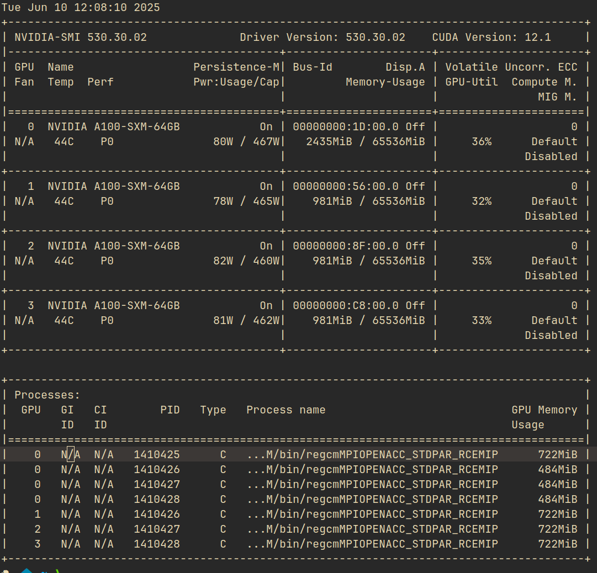
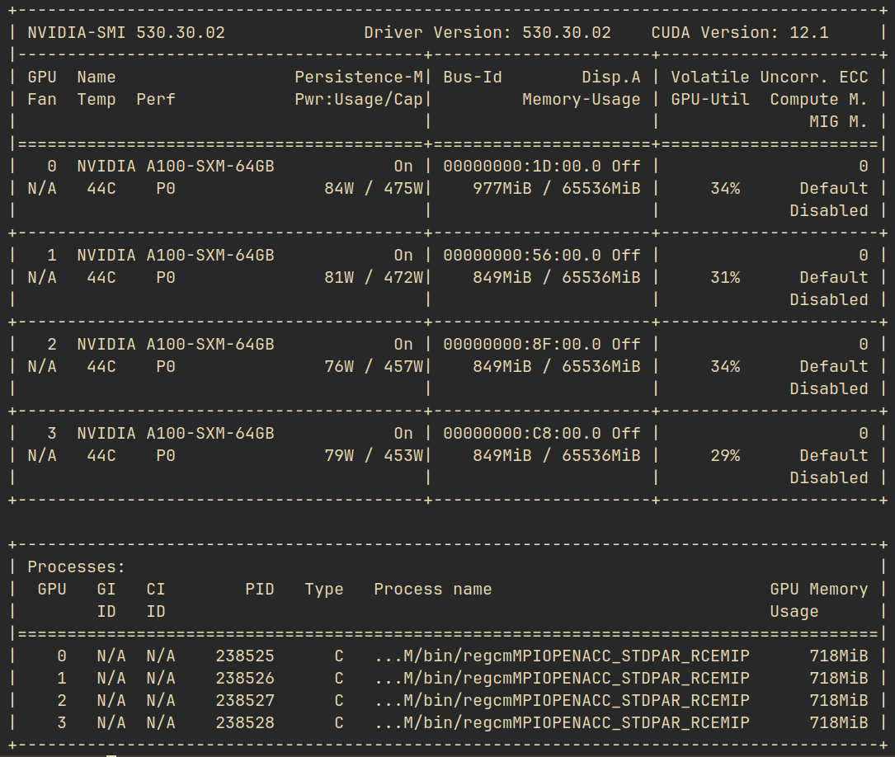

# Updates on I made on the RegCM source code                                                              

## June 10 2025
I ran the RegCM model on Leonardo using the following bash script: 
```bash
#!/bin/bash

#SBATCH --account=ICT25_MHPC_0
#SBATCH --qos=boost_qos_dbg
#SBATCH --out=./output/LOG_%x_%j.out
#SBATCH --err=./output/LOG_%x_%j.err
#SBATCH --job-name Std_Par
#SBATCH --ntasks-per-node=4
#SBATCH --partition=boost_usr_prod
#SBATCH --nodes=2
#SBATCH --gres=gpu:4
#SBATCH --mem=123000

source /leonardo/home/userexternal/ctica000/MS_thesis/RegCM/modules_cuda

cd /leonardo/home/userexternal/ctica000/MS_thesis/RegCM/run

export BINDIR=/leonardo/home/userexternal/ctica000/MS_thesis/RegCM/bin

srun $BINDIR/regcmMPIOPENACC_STDPAR_RCEMIP isc24_small.in
``` 
Connecting into one of the nodes and issuing `nvidia-smi`, we witnessed an oversubscription of `GPU 0` by all four processes .

This behaviors is not expected in view of the following subroutine from `RegCM/Main/mod_regcm_interface.F90` which implements one-to-one mapping of devices to the MPI processes:
```fortran
#ifdef OPENACC
  subroutine setup_openacc(mpi_rank)
    use openacc, only: acc_device_default, acc_device_kind, &
                  acc_get_device_type, acc_get_num_devices, &
                  acc_set_device_num, acc_init
    implicit none
    integer, intent(in) :: mpi_rank
    integer(ik4) :: idev, ndev
    integer(acc_device_kind) :: dev_type

    dev_type = acc_get_device_type()
    ndev = acc_get_num_devices(acc_device_default)
    idev = mod(mpi_rank, ndev)
    call acc_set_device_num(idev, dev_type)
    call acc_init(dev_type)
  end subroutine setup_openacc
#endif
```
I used the recommendation on this [article](https://developer.nvidia.com/blog/using-fortran-standard-parallel-programming-for-gpu-acceleration/) to use set the `CUDA_VISIBLE_DEVICES` for each MPI rank andd set it to the environment variable `SLURM_LOCALID`.


This variable is set by SLURM for every MPI rank and it corresponds to the local rank of the process on the node. See the documentation [here](https://slurm.schedmd.com/srun.html#SECTION_5). Thus we create the following launcher script that sets the environment for each MPI rank:
```bash
#!/bin/bash
# STD_launch_per_rank.sh

# Get the local rank of the current MPI process on this node
RANK=${SLURM_LOCALID}

# Optional safety check
if [ -z "$RANK" ]; then
  echo "SLURM_LOCALID not set; this script should be run under srun."
  exit 1
fi

# Assign each local rank to a unique GPU on this node
export CUDA_VISIBLE_DEVICES=$RANK
export ACC_DEVICE_TYPE=nvidia
export ACC_DEVICE_NUM=$RANK


export BINDIR=/leonardo/home/userexternal/ctica000/MS_thesis/RegCM/bin

# Launch the binary
exec $BINDIR/regcmMPIOPENACC_STDPAR_RCEMIP  isc24_small.in
```
I then made this script executable and launch it for each MPI rank using `srun` in the following job script:
```bash
#!/bin/bash

#SBATCH --account=ICT25_MHPC_0
#SBATCH --qos=boost_qos_dbg
#SBATCH --partition=boost_usr_prod
#SBATCH --out=./output/non_std/LOG_%x_%j.out
#SBATCH --err=./output/non_std/LOG_%x_%j.err
#SBATCH --job-name Not_Std_Par
#SBATCH --ntasks-per-node=4
#SBATCH --nodes=2
#SBATCH --gres=gpu:4
#SBATCH --mem=123000

source /leonardo/home/userexternal/ctica000/MS_thesis/RegCM/modules_cuda

cd /leonardo/home/userexternal/ctica000/MS_thesis/RegCM/run

# launch
srun ./STD_launch_per_rank.sh
```
For good measure, I also opted to keep using the subroutine `RegCM/Main?mod_regcm_interface.F90` with the necessary correction. We read the variable `ACC_DEVICE_NUM` set to `SLURM_LOCALID` in the launcher script above in the subroutine:
```fortran
#ifdef OPENACC
    subroutine setup_openacc(mpi_rank)
      use openacc, only: acc_device_default, acc_device_kind, &
                      acc_get_device_type, acc_get_num_devices, &
                      acc_set_device_num, acc_init
      implicit none
      integer, intent(in):: mpi_rank
      integer(ik4):: idev, ndev
      integer(acc_device_kind):: dev_type
      character(len = 16):: env
      integer:: status

      dev_type = acc_get_device_type()  ! Uses the device type set in the environment via ACC_DEVICE_TYPE
      call acc_init(dev_type)

      call get_environment_variable("ACC_DEVICE_NUM", env, status)
      if (status == 0) then
         read(env, *) idev
      else
         ndev = acc_get_num_devices(acc_device_default)
         idev = mod(mpi_rank, ndev)
      end if

      print *, 'MPI Rank:', mpi_rank, ' using device:', idev

      call acc_set_device_num(idev, dev_type)
    end subroutine setup_openacc
#endif
```
This gave the correct mapping of devices to the MPI ranks and we no longer see the oversubscription of `GPU 0`. The output of `nvidia-smi` now shows that each GPU is used by one process only .

